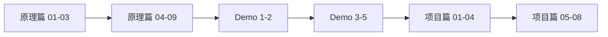

# Pi Agent 原理与实现：从零到一实现一个 AI Agent

> 基于 [earendil-works/pi](https://github.com/earendil-works/pi) 的渐进式中文教程，包含原理讲解、源码拆解、渐进式 Demo 和完整教学项目。

---

## 📖 这是什么？

这是一个面向计算机本科毕业生和初中级工程师的**手把手教学项目**。它不是简单的源码解读，而是把 [Pi Agent](https://pi.dev) 拆解成一套渐进式教程，让读者可以从零开始：

1. **先理解核心概念** — Agent 为什么需要状态、事件、工具与循环
2. **再通过 Demo 练手** — 5 个由浅入深的独立示例，每一步都可运行
3. **最后实现完整项目** — React 前端 + Node.js 后端，保留 Pi 的核心思想

整体风格像一个有实战经验的工程师在带徒弟，讲清楚"为什么这么设计""每一步在解决什么问题"，拒绝论文腔和只贴源码。

---

## 🗂️ 项目结构

```
pi-agent-tutorial/
├── docs/                          # VitePress 教程站点（本仓库核心）
│   ├── .vitepress/
│   │   └── config.mts             # VitePress 站点配置
│   ├── guide/                     # 📚 原理篇（11 章）
│   │   ├── 01-why-agent.md        # 为什么需要 Agent？
│   │   ├── 02-intro-pi.md         # 认识 Pi Agent
│   │   ├── 03-core-concepts.md    # 核心概念速览
│   │   ├── 04-message-flow.md     # 消息流与状态机
│   │   ├── 05-agent-loop.md       # Agent Loop
│   │   ├── 06-event-architecture.md   # 事件驱动架构
│   │   ├── 07-tool-system.md      # 工具系统与并行执行
│   │   ├── 08-session-compaction.md   # 会话树与上下文压缩
│   │   ├── 09-pi-ai-layer.md      # LLM 抽象层 pi-ai
│   │   ├── 10-code-map.md         # 代码目录与模块关系
│   │   └── 11-types-interfaces.md # 关键类型与接口
│   ├── demos/                     # 🛠️ Demo 篇（5 个）
│   │   ├── 01-hello-stream.md     # 流式 LLM 输出
│   │   ├── 02-manual-loop.md      # 手动 Agent Loop
│   │   ├── 03-tool-calls.md       # 工具调用与执行
│   │   ├── 04-event-ui.md         # 事件订阅与 UI
│   │   └── 05-steering-queue.md   # Steering 与队列
│   ├── project/                   # 🚀 项目篇（8 章）
│   │   ├── 01-overview.md         # 项目概述
│   │   ├── 02-tech-stack.md       # 技术选型与目录结构
│   │   ├── 03-backend-core.md     # 后端：Agent Core
│   │   ├── 04-backend-api.md      # 后端：HTTP API 与 SSE
│   │   ├── 05-frontend-chat.md    # 前端：React 聊天界面
│   │   ├── 06-frontend-tools.md   # 前端：工具执行可视化
│   │   ├── 07-integration.md      # 联调与运行
│   │   └── 08-extensions.md       # 扩展方向
│   ├── public/
│   │   └── logo.svg               # 站点 Logo
│   └── index.md                   # 首页
│
├── package.json                   # 项目依赖与脚本
├── README.md                      # 本文件
├── CONTRIBUTING.md                # 贡献指南
├── CHANGELOG.md                   # 版本记录
└── DEPLOY.md                      # 部署文档
```

---

## 🚀 快速开始

### 环境要求

- Node.js >= 18
- npm >= 9

### 安装与启动

```bash
# 1. 进入项目目录
cd pi-agent-tutorial

# 2. 安装依赖
npm install

# 3. 启动开发服务器
npm run docs:dev

# 4. 浏览器打开 http://localhost:5173
```

### 构建静态站点

```bash
npm run docs:build
```

构建产物位于 `docs/.vitepress/dist/`，可直接部署到任何静态托管服务。

### 预览构建产物

```bash
npm run docs:preview
```

---

## 📚 教程内容导航

### 学习路径建议



| 阶段 | 内容 | 预计时间 | 目标 |
|------|------|---------|------|
| **第一阶段** | 原理篇 01-03 | 1-2 小时 | 建立 Agent 认知框架 |
| **第二阶段** | 原理篇 04-09 | 3-4 小时 | 深入理解核心机制 |
| **第三阶段** | Demo 1-5 | 2-3 小时 | 动手验证关键概念 |
| **第四阶段** | 项目篇 01-08 | 4-6 小时 | 实现完整全栈应用 |

### 每章学习目标

**原理篇**

| 章节 | 学习目标 |
|------|---------|
| 01 | 理解 Agent 与"直接调 LLM API"的本质区别 |
| 02 | 了解 Pi 的设计哲学、四大模式、三大核心特性 |
| 03 | 掌握 AgentMessage、Loop、Event、Tool、Session 等核心术语 |
| 04 | 理解消息从诞生到被 LLM 消费的完整生命周期 |
| 05 | 掌握 Agent Loop 的内部结构和关键决策点 |
| 06 | 理解事件驱动架构的设计意图和实现方式 |
| 07 | 掌握工具系统的 Schema、校验、并行执行和错误处理 |
| 08 | 理解树形会话结构和上下文压缩机制 |
| 09 | 了解 pi-ai 如何用四种协议覆盖三十多家提供商 |
| 10 | 熟悉 Pi 的 monorepo 结构和教学版的取舍策略 |
| 11 | 掌握核心类型体系和 TypeScript 设计模式 |

**Demo 篇**

| Demo | 掌握能力 | 是否需要 API Key |
|------|---------|-----------------|
| 01 | 流式 LLM 输出 | ✅ 需要（或 Mock） |
| 02 | 状态管理、工具调用、自动循环 | ✅ 需要（或 Mock） |
| 03 | 多工具、并行执行、错误自纠正 | ✅ 需要（或 Mock） |
| 04 | 事件驱动、终端聊天 UI | ✅ 需要（或 Mock） |
| 05 | 运行时插入指令、人机协作 | ✅ 需要（或 Mock） |

**项目篇**

| 章节 | 交付物 |
|------|--------|
| 01-02 | 初始化好的前后端项目结构 |
| 03-04 | 可运行的后端服务（Agent Core + HTTP API + SSE） |
| 05-06 | 可交互的前端界面（聊天 + 工具可视化 + 会话管理） |
| 07 | 前后端联调通过，可完整运行 |
| 08 | 清晰的扩展路线图 |

---

## 🛠️ 技术栈

| 层级 | 技术 | 版本 | 用途 |
|------|------|------|------|
| 文档站点 | VitePress | ^1.6 | 静态站点生成 |
| 文档框架 | Vue 3 | ^3.5 | VitePress 底层框架 |
| 教学项目前端 | React | ^18 | UI 框架 |
| 教学项目前端 | TypeScript | ^5 | 类型系统 |
| 教学项目前端 | Tailwind CSS | ^3 | 原子化样式 |
| 教学项目前端 | Vite | ^5 | 构建工具 |
| 教学项目后端 | Node.js | >=18 | 运行时 |
| 教学项目后端 | Fastify | ^4 | Web 框架 |
| 教学项目后端 | SSE | - | 服务器推送 |

---

## 🎯 适合谁读？

- **计算机本科毕业生** — 想深入理解 AI Agent 的工程实现
- **前端/后端开发者** — 希望从"调 API"进阶到"搭系统"
- **技术爱好者** — 对 Pi、earendil-works/pi 感兴趣，想知其然更知其所以然

**前置知识**：
- 熟悉 TypeScript/JavaScript
- 了解基本的 HTTP 和异步编程
- 有 React 基础（项目篇需要）
- 了解 LLM 的基本概念（Prompt、Token 等）

---

## 📦 相关资源

- **Pi 官方仓库**: https://github.com/earendil-works/pi
- **Pi 官方文档**: https://pi.dev/docs/latest
- **Pi npm 包**: https://www.npmjs.com/package/@earendil-works/pi-agent-core
- **VitePress 文档**: https://vitepress.dev

---

## 📄 其他文档

- [CONTRIBUTING.md](./CONTRIBUTING.md) — 如何参与贡献
- [CHANGELOG.md](./CHANGELOG.md) — 版本变更记录
- [DEPLOY.md](./DEPLOY.md) — 部署到 GitHub Pages/Vercel 等平台的指南

---

## 📜 许可证

MIT License

---

> 💡 **提示**：如果你发现任何错误或有改进建议，欢迎提交 Issue 或 PR。详见 [CONTRIBUTING.md](./CONTRIBUTING.md)。
