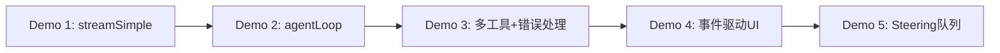

# Demo 5：Steering 与队列

> 最后一个 Demo 展示 Pi 最人性化的设计之一：在 Agent 运行时插入新指令。这在长任务执行中非常有用。

## 目标

模拟一个耗时任务（mock 的长时间计算），在任务执行过程中：
1. 用户发送 steering 消息中断当前思路
2. 观察 Agent 如何在完成当前工具后，响应 steering 消息
3. 用户发送 follow-up 消息，让 Agent 在结束后追加任务

## 代码

```ts
// demos/05-steering-queue/index.ts
import { Agent } from '@earendil-works/pi-agent-core'
import { getModel } from '@earendil-works/pi-ai'
import { Type } from '@sinclair/typebox'
import type { AgentTool } from '@earendil-works/pi-agent-core'

// 模拟耗时工具
const slowTool: AgentTool = {
  name: 'long_calculation',
  label: '长时间计算',
  description: '执行一个需要 5 秒的复杂计算',
  parameters: Type.Object({ n: Type.Number() }),
  execute: async (id, params, signal, onUpdate) => {
    for (let i = 0; i < 5; i++) {
      await new Promise((r) => setTimeout(r, 1000))
      onUpdate?.({
        content: [{ type: 'text', text: `Progress: ${(i + 1) * 20}%` }],
        details: { step: i + 1 },
      })
    }
    return {
      content: [{ type: 'text', text: `Result of calculation(${params.n}) = ${params.n * 42}` }],
      details: { duration: 5000 },
    }
  },
}

const agent = new Agent({
  initialState: {
    systemPrompt: 'You are a helpful assistant.',
    model: getModel('openai', 'gpt-4o-mini'),
    tools: [slowTool],
    messages: [],
  },
  convertToLlm: (msgs) => msgs.filter((m) => ['user', 'assistant', 'toolResult'].includes(m.role)),
  steeringMode: 'one-at-a-time',
  followUpMode: 'one-at-a-time',
})

agent.subscribe((event) => {
  switch (event.type) {
    case 'message_update':
      if (event.assistantMessageEvent.type === 'text_delta') {
        process.stdout.write(event.assistantMessageEvent.delta)
      }
      break
    case 'tool_execution_start':
      console.log(`\n[Tool] ${event.toolName} started`)
      break
    case 'tool_execution_update':
      console.log(`[Tool] ${event.partialResult.content[0].text}`)
      break
    case 'tool_execution_end':
      console.log(`[Tool] ${event.toolName} finished`)
      break
    case 'turn_end':
      console.log('\n[Turn ended]')
      break
    case 'agent_end':
      console.log('\n[Agent finished]')
      break
  }
})

async function main() {
  // 启动一个长任务
  const promptPromise = agent.prompt('Please run long_calculation with n=10')

  // 模拟用户在 2 秒后插入 steering
  setTimeout(() => {
    console.log('\n[User] Steering: Stop the calculation, just say hello instead')
    agent.steer({
      role: 'user',
      content: 'Stop the calculation, just say hello instead',
      timestamp: Date.now(),
    })
  }, 2000)

  // 模拟用户在 3 秒后插入 follow-up
  setTimeout(() => {
    console.log('[User] Follow-up: Also tell me a joke')
    agent.followUp({
      role: 'user',
      content: 'Also tell me a joke',
      timestamp: Date.now(),
    })
  }, 3000)

  await promptPromise
  console.log('\n[All done]')
}

main()
```

## 运行

```bash
cd demos/05-steering-queue
npm install @earendil-works/pi-agent-core @earendil-works/pi-ai @sinclair/typebox
export OPENAI_API_KEY=sk-...
npx tsx index.ts
```

## 观察重点

### Steering 的时序

```
[Agent] 开始 long_calculation
[Tool] long_calculation started
[Tool] Progress: 20%
[Tool] Progress: 40%
[User] Steering: Stop the calculation...
[Tool] Progress: 60%
[Tool] Progress: 80%
[Tool] Progress: 100%
[Tool] long_calculation finished
[Turn ended]
[Agent] Hello!  ← 响应 steering 消息
[Turn ended]
[Agent finished]
```

**关键**：steering 消息不会中断正在执行的工具！它会在**当前 turn 结束后**被注入。

### Follow-up 的时序

follow-up 消息优先级低于 steering。如果 steering 队列不为空，follow-up 会等待。

### 队列模式对比

| 模式 | steeringMode | 行为 |
|------|-------------|------|
| `one-at-a-time` | 每次只消费一条 steering | 适合精细控制 |
| `all` | 一次性消费所有 steering | 适合批量注入 |

## 思考题

如果用户在 Agent 空闲时（`isStreaming === false`）调用 `steer()`，会发生什么？（提示：steering 消息会被排队，但下次 `prompt()` 时会立即处理吗？）

## Demo 总结

五个 Demo 的递进关系：



- Demo 1 让你感受**流式输出**
- Demo 2 让你理解**循环和状态**
- Demo 3 让你掌握**工具系统**
- Demo 4 让你学会**事件驱动 UI**
- Demo 5 让你体验**人机协作**

这些能力组合起来，就是一个完整的 Agent 产品。

## 下一步

进入 [项目实现篇](/project/01-overview.html)，我们将把这些 Demo 组合成一个全栈应用。
