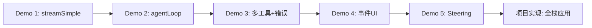

# 渐进式 Demo

> 不要一开始就写大项目。这 5 个 Demo 带你从最简单的流式输出，逐步掌握 Agent 的核心机制。

## Demo 列表

| Demo | 主题 | 掌握的能力 |
|------|------|-----------|
| [Demo 1](01-hello-stream) | Hello Stream | 流式 LLM 输出 |
| [Demo 2](02-manual-loop) | 手动 Agent Loop | 状态管理、工具调用、自动循环 |
| [Demo 3](03-tool-calls) | 工具调用与执行 | 多工具、并行执行、错误自纠正 |
| [Demo 4](04-event-ui) | 事件订阅与 UI | 事件驱动、终端聊天界面 |
| [Demo 5](05-steering-queue) | Steering 与队列 | 运行时插入指令、人机协作 |

## 运行方式

每个 Demo 都是独立的 TypeScript 文件，可以直接运行：

```bash
cd demos/0X-demo-name
npm install
export OPENAI_API_KEY=sk-...
npx tsx index.ts
```

> 部分 Demo 支持 `useMock: true`，无需 API key 即可运行。

## 递进关系



每个 Demo 都是下一个的基础。建议按顺序完成。
