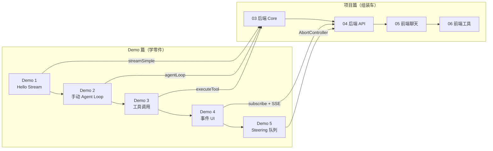

# 渐进式 Demo

> 不要一开始就写大项目。这 5 个 Demo 带你从最简单的流式输出，逐步掌握 Agent 的核心机制。
>
> **Demo 和项目的关系**：Demo 是"零件"，项目是"整车"。每个 Demo 聚焦一个机制，项目篇把它们组装成完整应用。

## Demo 与项目篇的对应关系



| Demo | 学到的机制 | 在项目篇哪里用到 |
|------|-----------|---------------|
| **Demo 1** `streamSimple` | 流式 LLM 输出 | `backend/src/llm/openai-client.ts` |
| **Demo 2** `agentLoop` | 状态管理、自动循环 | `backend/src/core/agent-loop.ts` |
| **Demo 3** 工具调用 | Schema、并行执行、错误恢复 | `backend/src/tools/*.ts` |
| **Demo 4** 事件订阅 | 事件驱动 UI 更新 | `frontend/src/hooks/useAgent.ts` |
| **Demo 5** Steering | 运行时中断、人机协作 | `backend/src/core/agent.ts` (AbortController) |

## 学习建议

### 路径一：先跑 Demo，再读项目（推荐）

```
Demo 1 → Demo 2 → Demo 3 → Demo 4 → Demo 5
    ↓         ↓         ↓         ↓         ↓
  理解流式   理解循环    理解工具    理解事件    理解中断
    ↓         ↓         ↓         ↓         ↓
    └─────────┴─────────┴─────────┴─────────┘
                      ↓
              项目篇 03-06
              "原来这些代码是这么来的"
```

**适合**：时间充裕、喜欢循序渐进的学习者。

### 路径二：直接读项目，遇到不懂的回头查 Demo

```
项目篇 03 → "agentLoop 是什么？" → 回头读 Demo 2
项目篇 04 → "SSE 怎么工作的？" → 回头读 Demo 4
项目篇 05 → "useAgent 怎么来的？" → 回头读 Demo 4
```

**适合**：有一定基础、喜欢从整体上手的开发者。

### 路径三：对比学习（效率最高）

```
读 Demo 1 的代码 → 立刻看项目中对应的实现 → 对比差异
读 Demo 2 的代码 → 立刻看项目中对应的实现 → 对比差异
...
```

**关键问题**："Demo 里只有 20 行，项目里为什么有 200 行？多出来的代码在解决什么问题？"

## Demo 列表

| Demo | 主题 | 掌握的能力 | 是否需要 API Key |
|------|------|-----------|-----------------|
| [Demo 1](01-hello-stream) | Hello Stream | 流式 LLM 输出 | ✅ 需要（或 Mock） |
| [Demo 2](02-manual-loop) | 手动 Agent Loop | 状态管理、工具调用、自动循环 | ✅ 需要（或 Mock） |
| [Demo 3](03-tool-calls) | 工具调用与执行 | 多工具、并行执行、错误自纠正 | ✅ 需要（或 Mock） |
| [Demo 4](04-event-ui) | 事件订阅与 UI | 事件驱动、终端聊天界面 | ✅ 需要（或 Mock） |
| [Demo 5](05-steering-queue) | Steering 与队列 | 运行时插入指令、人机协作 | ✅ 需要（或 Mock） |

## 运行方式

每个 Demo 都是独立的 TypeScript 文件，可以直接运行：

```bash
cd demos/0X-demo-name
npm install
export OPENAI_API_KEY=sk-...
npx tsx index.ts
```

> 部分 Demo 支持 `useMock: true`，无需 API key 即可运行。

## 从 Demo 到项目的演进示例

### Demo 2 的 agentLoop（简化版）

```ts
// demos/02-manual-loop/index.ts
for await (const event of agentLoop([userMessage], context, config)) {
  console.log(event.type)
}
```

### 项目中的 agentLoop（生产版）

```ts
// playground/backend/src/core/agent-loop.ts
export async function runAgentLoop(
  userMessages: Message[],
  context: AgentContext,
  config: LoopConfig,
  emit: (event: AgentEvent) => void,
  signal?: AbortSignal        // ← Demo 没有的：取消信号
): Promise<Message[]> {
  // ← Demo 没有的：turn 次数限制
  // ← Demo 没有的：工具并行/串行执行
  // ← Demo 没有的：错误捕获和转换
}
```

**多出来的代码在解决什么？**

| 增加的功能 | 解决的问题 |
|-----------|-----------|
| `signal?: AbortSignal` | 用户断开后取消正在进行的 LLM 调用 |
| `maxTurns = 10` | 防止工具调用死循环（如工具一直返回错误，LLM 一直重试） |
| `toolExecution: 'parallel'` | 多个工具并发执行，减少总等待时间 |
| `try/catch` + `isError` | 工具执行失败时优雅降级，让 LLM 自己决定如何恢复 |

## 下一步

- 如果你还没跑过 Demo，建议从 [Demo 1](01-hello-stream) 开始
- 如果你已经熟悉这些概念，直接跳到 [项目篇 01 项目概述](/project/01-overview)
