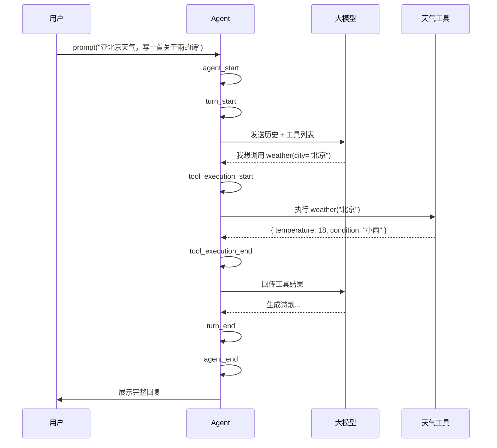

# 01 为什么需要 Agent？

> 在动手写代码之前，先回答一个问题：Agent 和“直接调 LLM API”到底有什么区别？

## 直接调 API 的局限

假设你写了一个最简单的聊天机器人：

```ts
const reply = await openai.chat.completions.create({
  model: 'gpt-4o',
  messages: [{ role: 'user', content: '北京今天天气怎么样？' }],
})
console.log(reply.choices[0].message.content)
```

LLM 会“编造”一个答案——因为它没有实时数据。为了解决这个问题，你可能会尝试：

1. **在 Prompt 里塞工具说明**：告诉模型“你可以调用天气 API”，但模型只是生成文本，不会真的去调。
2. **手动解析输出**：用正则提取 `{"tool": "weather", "city": "北京"}`，然后自己执行，再把结果塞回去。这很快会变成一团正则 spaghetti。
3. **忘记历史**：每次请求都是独立的，模型不记得上一轮说了什么。

这些问题的根源在于：**LLM 本身只有“生成文本”这一个能力**，它不能：
- 记住对话历史
- 调用外部工具
- 根据工具返回结果继续推理
- 自主决定“什么时候该停下来”

## Agent 是什么？

Agent（智能体）是在 LLM 外围包裹的一层**运行时**，它赋予模型以下能力：

| 能力 | 直接调 API | Agent |
|------|-----------|-------|
| 状态管理 | ❌ 无 | ✅ 维护消息历史 |
| 工具调用 | ❌ 手动解析 | ✅ 自动识别、执行、回传 |
| 多轮推理 | ❌ 手动拼接 | ✅ 自动循环（Loop） |
| 流式输出 | ⚠️ 需自行处理 | ✅ 标准化事件流 |
| 中断/恢复 | ❌ 无 | ✅ Steering、Follow-up 队列 |

用一句话概括：**Agent = LLM + 状态 + 工具 + 事件循环 + 会话管理**。

## 一个最小 Agent 的运行过程

想象你问 Agent：“帮我查一下北京天气，然后写一首关于雨的诗。”



这个过程里，Agent 做了几件关键的事：

1. **维护上下文**：把用户的提问、模型的思考、工具的返回结果都保存在一个有序列表里。
2. **识别工具调用**：从模型的输出中解析出 `toolCall` 结构。
3. **执行并回传**：调用真实工具，把结果格式化成 `toolResult` 消息，再交给模型。
4. **决定何时结束**：当模型不再调用工具、直接给出最终答案时，Agent 结束这一轮运行。

## 为什么不是“更复杂的 Prompt”？

有人可能会想：我在 Prompt 里写清楚“如果你需要天气，就输出 JSON，我会帮你查”，然后在外层写个 `while` 循环不就行了？

理论上可以，但生产级 Agent 要面对的问题远比这复杂：

- **Schema 校验**：模型输出的 JSON 可能缺字段、类型错误，需要自动报错并让模型重试。
- **并行工具**：模型一次可能请求 3 个工具，有的可以并行，有的必须串行。
- **流式体验**：用户不想等 10 秒才看到结果，需要逐字显示思考过程。
- **中断与恢复**：用户可能在工具执行到一半时说“等等，换个城市”。
- **上下文爆炸**：聊久了 token 超限，需要智能压缩历史。

这些正是 **Pi Agent** 已经解决、并且以极简核心暴露给你的问题。

## 本章小结

- Agent 不是替代 LLM，而是**让 LLM 具备行动能力**的运行时框架。
- 核心差异在于：**状态管理、工具执行、事件循环、会话持久化**。
- 接下来，我们将以 Pi 为参考，逐层拆解这些机制的实现原理。

## 小练习

试着画一张时序图：如果你要让一个“直接调 API”的程序完成“查天气 → 写诗”这个任务，需要写哪些步骤？和 Agent 的自动循环相比，手动实现最麻烦的地方在哪里？
