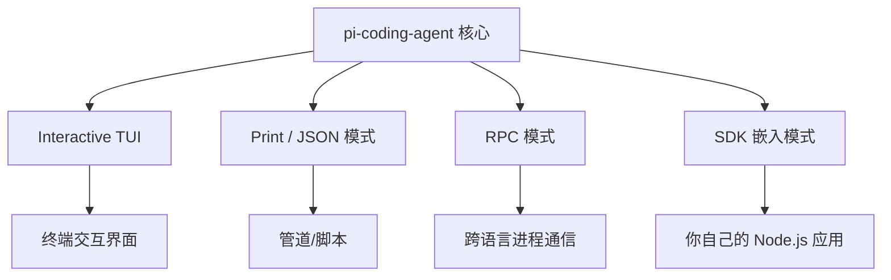
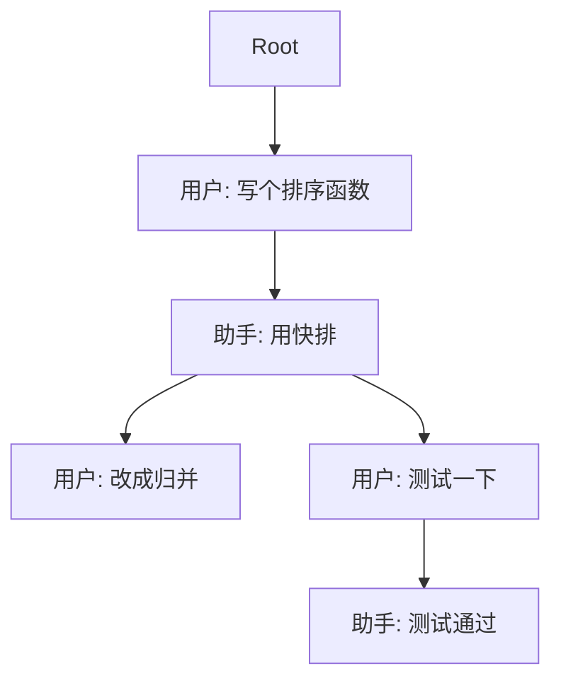
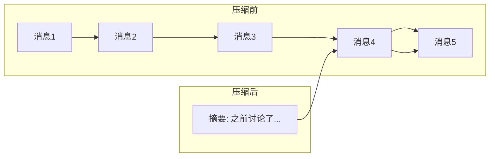

# 02 认识 Pi Agent

> Pi 是一个极简终端编码工具（minimal terminal coding harness），由 Mario Zechner（libGDX 作者）创建。它的核心设计哲学是：**保持核心极小，通过扩展系统满足一切需求**。

## Pi 是什么？

Pi 的全称是 **Pi Coding Agent**，你可以把它理解为：

- 一个运行在终端里的 AI 编程助手
- 一套可嵌入 Node.js 应用的 Agent SDK
- 一个展示“如何优雅地构建 Agent”的开源范本

它的代码仓库是 [earendil-works/pi](https://github.com/earendil-works/pi)，以 monorepo 形式组织，核心包包括：

| 包名 | 职责 | 类比 |
|------|------|------|
| `pi-ai` | LLM 提供商抽象层 | 类似 OpenAI SDK，但支持 30+ 提供商 |
| `pi-agent-core` | Agent 循环、工具执行、事件流 | Agent 的“心脏” |
| `pi-coding-agent` | 终端 CLI、会话管理、扩展系统 | 完整产品 |
| `pi-tui` | 终端 UI 渲染组件 | 差分渲染，防闪烁 |

本教程的重点是 **`pi-agent-core`**，因为它包含了 Agent 最核心的设计思想。

## Pi 的四大运行模式

同一套核心逻辑，支撑了四种完全不同的使用方式：

1. **Interactive TUI**：默认模式，打开终端输入 `pi`，进入全屏交互界面。
2. **Print / JSON 模式**：`pi -p "review this code" < file.ts`，适合脚本化调用。
3. **RPC 模式**：通过 stdin/stdout 的 JSONL 协议与外部进程通信。
4. **SDK 模式**：直接 `import { createAgentSession }` 嵌入你的应用。

这种设计的好处是：**核心逻辑一次写好，到处复用**。无论你是想做一个网页版 Chatbot，还是一个 CLI 工具，底层的事件流和工具执行逻辑完全一致。

## 核心设计哲学

### 1. 极小核心，极大扩展

Pi 的核心只有四个内置工具：`read`、`write`、`edit`、`bash`。但它提供了：

- **Extensions**：TypeScript 模块，可以注册自定义工具、命令、事件处理器
- **Skills**：Markdown 文件，定义特定任务的指令模板
- **Prompt Templates**：可复用的提示词，支持参数展开
- **Themes**：终端主题
- **Pi Packages**：把扩展打包成 npm 包分享

### 2. 会话即树

大多数聊天应用的历史是线性的：消息 1 → 消息 2 → 消息 3。Pi 把会话建模成**树结构**：

每个节点都有 `id` 和 `parentId`，你可以：
- 在任意节点分叉（`/fork`）
- 在树中导航（`/tree`）
- 回到任意历史节点继续对话

所有数据保存在一个**追加式的 JSONL 文件**中，历史永不丢失。

### 3. 上下文压缩（Compaction）

LLM 的上下文窗口有限。当对话越来越长时，Pi 会自动：

1. 找到“切割点”：保留最近 N 个 token 的消息
2. 让 LLM 把更早的消息总结成一段摘要
3. 把摘要保存为 `CompactionEntry`，替换掉被压缩的消息
4. 下次请求时，先发送摘要，再发送保留的详细消息

这样既能控制 token 用量，又不会丢失关键上下文。

## 为什么选 Pi 做教学参考？

市面上有很多 Agent 框架（LangChain、AutoGPT、Claude Code 等），Pi 的独特优势在于：

| 维度 | Pi | 其他框架 |
|------|-----|---------|
| 代码量 | 极小核心，易读 | 往往庞大复杂 |
| 抽象层级 | 恰到好处 | 要么太薄（自己造轮子），要么太厚（黑盒） |
| 类型安全 | 全 TypeScript，类型精确 | 部分框架类型松散 |
| 事件系统 | 标准化、可观测 | 往往各自为政 |
| 扩展性 | 插件化设计 | 耦合度高 |

对于学习者来说，Pi 是一个**“ Goldilocks ”选择**：不会让你迷失在框架细节里，也不会让你从零开始踩所有坑。

## 本章小结

- Pi 是极简终端编码工具，核心包 `pi-agent-core` 包含 Agent 循环、工具执行、事件流。
- 四种运行模式（TUI / Print / RPC / SDK）共享同一套核心逻辑。
- 三大设计哲学：极小核心+极大扩展、会话即树、自动上下文压缩。

## 小练习

去 [pi.dev](https://pi.dev) 浏览官方文档，试着回答：
1. Pi 的 `read` 工具和 `bash` 工具分别解决什么问题？
2. `/tree` 命令和 `/fork` 命令的区别是什么？
3. 如果你要在 Pi 里添加一个“查询数据库”的能力，应该通过 Extensions 还是 Skills？
