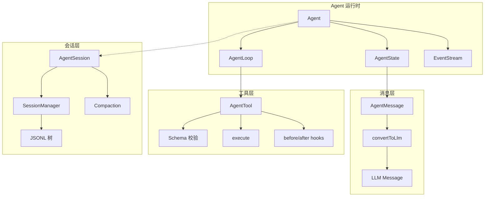
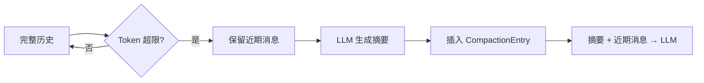

# 03 核心概念速览

> 在深入源码之前，先把 Pi Agent 里的关键术语和它们之间的关系梳理清楚。这些概念会贯穿整个教程。

## 概念地图



## 1. AgentMessage vs LLM Message

这是 Pi 里最重要的抽象之一。

```ts
// LLM 能看懂的消息（来自 pi-ai）
type Message = UserMessage | AssistantMessage | ToolResultMessage

// Agent 内部使用的消息（来自 pi-agent-core）
type AgentMessage = Message | CustomAgentMessages[keyof CustomAgentMessages]
```

**为什么要区分？**

因为应用层经常需要一些“LLM 不需要知道”的消息，比如：
- UI 通知（"用户正在输入..."）
- 系统状态（"模型已切换为 gpt-4o"）
- 扩展自定义消息

这些消息可以放在 `AgentMessage[]` 里参与应用逻辑，但在发给 LLM 之前，通过 `convertToLlm` 函数过滤掉：

```ts
AgentMessage[] → transformContext() → AgentMessage[] → convertToLlm() → Message[] → LLM
                (可选，用于剪枝/注入)         (必须，过滤+转换)
```

## 2. AgentState：Agent 的“内存”

```ts
interface AgentState {
  systemPrompt: string      // 系统提示词
  model: Model              // 当前使用的模型
  thinkingLevel: ThinkingLevel // 推理深度
  tools: AgentTool[]        // 可用工具列表
  messages: AgentMessage[]  // 完整对话历史
  isStreaming: boolean      // 是否正在运行
  streamingMessage?: AgentMessage // 当前流式消息（部分）
  pendingToolCalls: ReadonlySet<string> // 正在执行的工具
  errorMessage?: string     // 最近一次错误
}
```

你可以把 `AgentState` 理解为 Agent 的**工作记忆**。每次 LLM 调用前，Agent 都会把当前状态打包成请求上下文。

> 💡 **设计意图**：`tools` 和 `messages` 的 setter 会自动拷贝顶层数组，防止外部引用意外修改内部状态。

## 3. Agent Loop：思考-行动-观察的引擎

Agent Loop 是 Pi 的心脏。它是一个**异步生成器**，每次运行产生一系列 `AgentEvent`：

```ts
for await (const event of agentLoop([userMessage], context, config)) {
  console.log(event.type)
}
```

一次典型的 `prompt()` 调用会产生这样的事件序列：

```
prompt("Hello")
├─ agent_start          // 开始运行
├─ turn_start           // 新一轮开始
├─ message_start        // 用户消息开始
├─ message_end          // 用户消息结束
├─ message_start        // 助手消息开始（LLM 响应）
├─ message_update       // 流式文本片段
├─ message_update       // ...
├─ message_end          // 助手消息结束
├─ turn_end             // 本轮结束（无工具调用）
└─ agent_end            // 运行结束
```

如果助手调用了工具：

```
├─ message_end          // 助手消息（包含 toolCall）
├─ tool_execution_start // 工具开始执行
├─ tool_execution_update// 工具流式输出（可选）
├─ tool_execution_end   // 工具执行结束
├─ message_start/end    // toolResult 消息
├─ turn_end             // 本轮结束
├─ turn_start           // 下一轮开始（自动继续）
├─ message_start        // 助手对工具结果的回应
├─ ...
└─ agent_end
```

## 4. AgentTool：让 LLM 拥有“手”

```ts
interface AgentTool<TParameters extends TSchema> extends Tool<TParameters> {
  label: string
  execute: (
    toolCallId: string,
    params: Static<TParameters>,
    signal?: AbortSignal,
    onUpdate?: AgentToolUpdateCallback
  ) => Promise<AgentToolResult>
  executionMode?: 'sequential' | 'parallel'
}
```

关键设计：

| 特性 | 说明 |
|------|------|
| **Schema 驱动** | 使用 TypeBox 定义参数结构，自动校验 |
| **错误即异常** | `execute` 里 throw Error，Agent 会自动捕获并转为 `isError: true` 的 toolResult |
| **流式更新** | `onUpdate` 回调让长任务（如 bash 命令）可以实时报告进度 |
| **执行模式** | `parallel`（默认）允许多个工具并发；`sequential` 强制串行 |

## 5. Steering & Follow-up：人机协作的“方向盘”

这是 Pi 非常人性化的设计：

- **Steering（转向）**：在 Agent 运行过程中，用户可以插入新指令。比如 Agent 正在执行一个耗时命令，你说“停，先检查一下磁盘空间”。
- **Follow-up（跟进）**：在 Agent 即将结束时，自动追加任务。比如“顺便把结果保存到文件”。

```ts
agent.steeringMode = 'one-at-a-time'
agent.followUpMode = 'one-at-a-time'

// Agent 正在运行时插入
agent.steer({ role: 'user', content: 'Stop! Do this instead.', timestamp: Date.now() })

// Agent 结束后自动执行
agent.followUp({ role: 'user', content: 'Also summarize the result.', timestamp: Date.now() })
```

两种队列模式：
- `one-at-a-time`：每次只消费一条，适合精细控制
- `all`：一次性全部注入，适合批量任务

## 6. SessionManager：对话的“版本控制”

```ts
class SessionManager {
  appendMessage(message)   // 追加消息（自动维护 parentId）
  branch(entryId)          // 从历史节点分叉
  buildSessionContext()    // 构建当前分支的完整上下文
  getTree()                // 获取树形结构
}
```

会话文件是**追加式 JSONL**：

```jsonl
{"type":"session","id":"sess-001","timestamp":"...","cwd":"/project"}
{"type":"message","id":"e1","parentId":null,"timestamp":"...","message":{...}}
{"type":"message","id":"e2","parentId":"e1","timestamp":"...","message":{...}}
{"type":"compaction","id":"e3","parentId":"e2","summary":"...","firstKeptEntryId":"e2"}
```

每个 entry 都有 `id` 和 `parentId`，天然形成树结构。`leafId` 指针标记当前位置，分叉时只需移动指针，无需复制历史。

## 7. Compaction：上下文“垃圾回收”

当 `contextTokens > contextWindow - reserveTokens` 时触发：

1. 从最新消息往回走，保留 `keepRecentTokens` 内的消息
2. 把更早的消息发给 LLM，要求生成结构化摘要
3. 插入 `CompactionEntry`，包含摘要和 `firstKeptEntryId`
4. 下次 `buildSessionContext()` 时，用摘要替代被压缩的消息



## 概念对比表

| 概念 | 类比 | 解决的问题 |
|------|------|-----------|
| AgentMessage | 应用层 DTO | 允许 UI/扩展消息与 LLM 消息共存 |
| convertToLlm | 数据转换器 | 在 Agent 内部表示和 LLM 协议之间架桥 |
| Agent Loop | 主循环 / 游戏引擎 | 自动化“思考-行动-观察”循环 |
| AgentEvent | DOM Event / Redux Action | 让 UI 和外部系统可观测 Agent 内部状态 |
| AgentTool | 函数注册表 | 让 LLM 安全地调用外部能力 |
| Steering | 中断信号 | 运行时不丢失控制权的用户介入 |
| SessionManager | Git 分支 | 非线性对话历史、回溯、实验 |
| Compaction | 日志压缩 | 长对话的 token 预算管理 |

## 本章小结

- **AgentMessage** 是内部通用表示，**Message** 是 LLM 专用格式，`convertToLlm` 负责桥接。
- **Agent Loop** 通过事件流驱动整个“思考-行动-观察”循环。
- **AgentTool** 用 Schema + 执行函数 + Hooks 实现安全、可观测的工具调用。
- **Steering/Follow-up** 队列让人类在 Agent 运行时保持控制权。
- **SessionManager + Compaction** 解决了对话历史的持久化和长上下文问题。

## 常见错误

❌ **混淆 `AgentMessage` 和 `Message`**
> 在 `agentLoop` 里操作的是 `AgentMessage`，只有最后发给 LLM 时才变成 `Message`。如果你在 `convertToLlm` 里忘记过滤自定义消息，LLM 提供商可能会报错。

❌ **以为 `agent_end` 等于“立即结束”**
> `agent_end` 是最后一个事件，但 `await agent.waitForIdle()` 还要等所有 `agent_end` 的监听器执行完才算真正结束。

❌ **在 `execute` 里返回错误对象而不是 throw**
> Pi 的设计是：成功返回 `AgentToolResult`，失败直接 `throw new Error()`。Agent 会自动包装成 `isError: true` 的 toolResult。如果你手动返回错误内容，可能会丢失错误标记。
