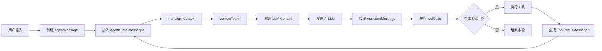
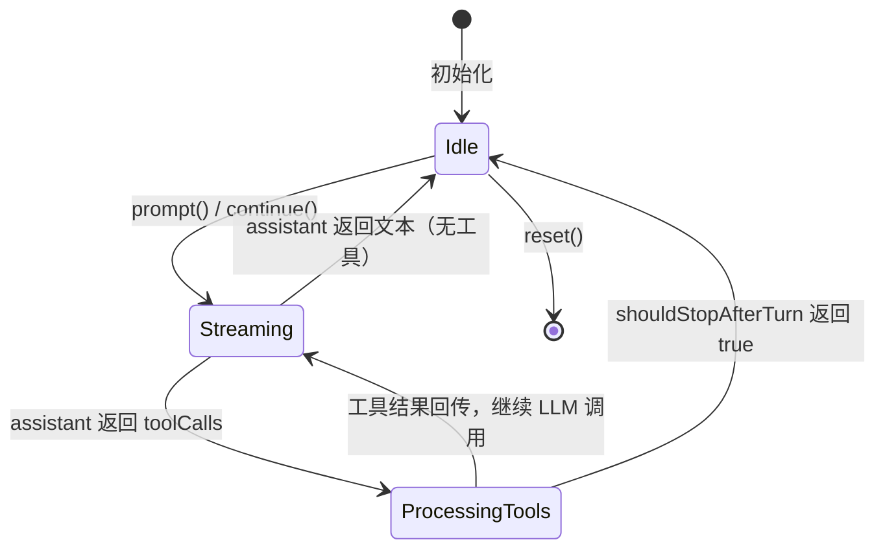
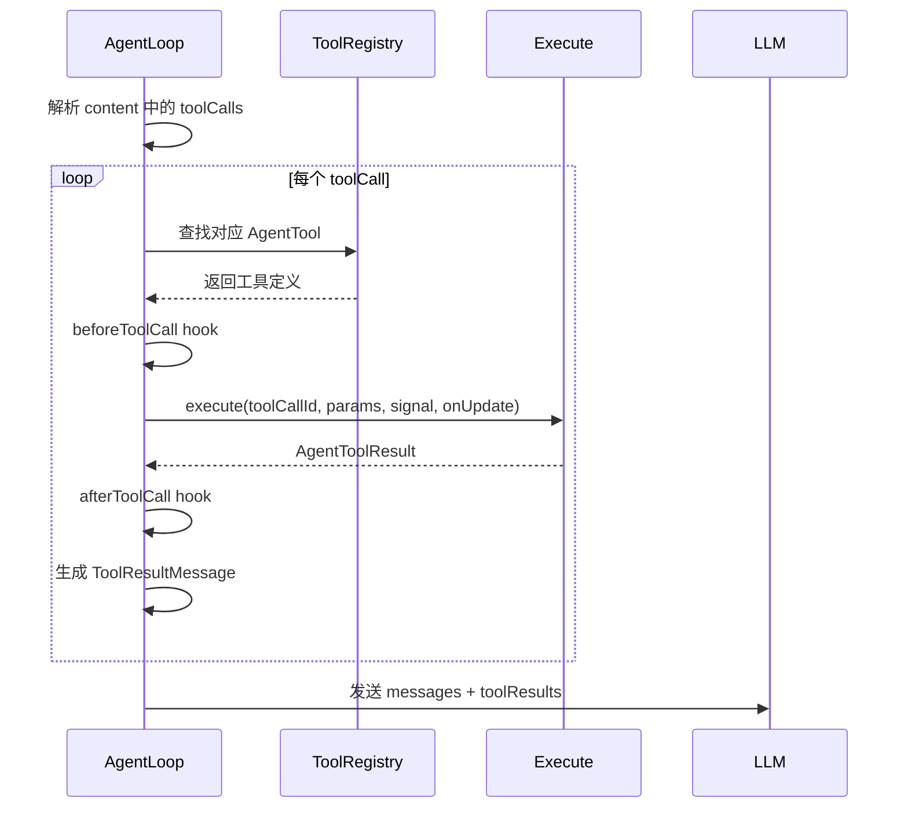

# 04 消息流与状态机

> Agent 的本质是一个状态机。理解消息如何在各个状态之间流转，是掌握 Agent 实现的关键。

## 消息的生命周期

在 Pi 中，一条消息从诞生到被 LLM 消费，要经历多个阶段：



## AgentState 的演进

让我们用具体代码来看状态如何变化：

```ts
import { Agent } from '@earendil-works/pi-agent-core'
import { getModel } from '@earendil-works/pi-ai'

const agent = new Agent({
  initialState: {
    systemPrompt: 'You are a helpful assistant.',
    model: getModel('anthropic', 'claude-sonnet-4-20250514'),
    messages: [],
    tools: [],
  },
})

// 状态 1：初始状态
console.log(agent.state.messages) // []

await agent.prompt('Hello!')

// 状态 2：prompt 执行后
// messages = [
//   { role: 'user', content: 'Hello!', timestamp: ... },
//   { role: 'assistant', content: [{ type: 'text', text: 'Hi there!' }], ... }
// ]
```

一次 `prompt()` 调用内部的状态变迁：



## 消息数组的“追加-only”语义

Pi 的 `messages` 数组遵循**追加-only**原则：

```ts
// ✅ 正确：添加新消息
agent.state.messages.push(newMessage)

// ✅ 正确：替换整个数组（内部会自动拷贝）
agent.state.messages = [...agent.state.messages, newMessage]

// ⚠️ 注意：直接修改数组元素不会触发拷贝
const msgs = agent.state.messages
msgs[0].content = 'hacked' // 可能意外修改内部状态
```

> 为什么设计为追加-only？因为 SessionManager 需要把每条消息持久化到 JSONL。如果允许随意修改历史，持久化层会变得极其复杂。

## transformContext：运行时的“消息手术”

`transformContext` 在每次 LLM 调用前执行，让你有机会修改消息列表：

```ts
const agent = new Agent({
  transformContext: async (messages, signal) => {
    // 场景 1：Token 超限，剪掉旧消息
    if (estimateTokens(messages) > MAX_TOKENS) {
      return pruneOldMessages(messages)
    }

    // 场景 2：注入外部上下文
    const latestNews = await fetchLatestNews()
    return [
      ...messages,
      { role: 'user', content: `[Context] ${latestNews}`, timestamp: Date.now() },
    ]

    // 场景 3：完全替换（比如做 RAG）
    // return buildRagContext(messages)
  },
})
```

**执行时机**：

```
turn_start
  → 准备 context
    → transformContext(messages)  ← 在这里
      → convertToLlm(messages)
        → 发送给 LLM
```

## convertToLlm：从内部表示到外部协议

这是**必须提供**的函数，负责把 `AgentMessage[]` 转成 LLM 能理解的 `Message[]`：

```ts
const agent = new Agent({
  convertToLlm: (messages) =>
    messages.flatMap((m) => {
      // 过滤掉 UI 通知
      if (m.role === 'notification') return []

      // 把自定义类型转成标准 user 消息
      if (m.role === 'custom') {
        return [{ role: 'user', content: m.text, timestamp: m.timestamp }]
      }

      // 标准消息直接透传
      return [m]
    }),
})
```

**常见模式**：

| 场景 | 实现策略 |
|------|---------|
| 纯标准对话 | `messages.filter(m => ['user','assistant','toolResult'].includes(m.role))` |
| 带 UI 状态 | 过滤 `notification`、`typing` 等角色 |
| 扩展消息 | 把自定义角色映射到 `user` 或 `assistant` |
| 图片消息 | 保留 `ImageContent`，直接透传 |

## 工具结果如何回到循环？

这是 Agent Loop 最精妙的部分。当 AssistantMessage 包含 toolCalls 时：

```ts
// AssistantMessage 的内容可能是：
{
  role: 'assistant',
  content: [
    { type: 'text', text: 'Let me check the weather.' },
    { type: 'toolCall', id: 'call_1', name: 'weather', arguments: { city: 'Beijing' } }
  ],
  stopReason: 'toolUse'
}
```

Agent Loop 的处理流程：



生成的 ToolResultMessage：

```ts
{
  role: 'toolResult',
  toolCallId: 'call_1',
  toolName: 'weather',
  content: [{ type: 'text', text: '{"temperature": 18, "condition": "rain"}' }],
  isError: false,
  timestamp: Date.now()
}
```

这条消息会被追加到 `context.messages`，然后进入下一轮 LLM 调用。

## 状态快照与恢复

Agent 在每次运行时会创建一个上下文快照：

```ts
interface AgentContext {
  systemPrompt: string
  messages: AgentMessage[]
  tools?: AgentTool[]
}
```

这个快照有几个用途：

1. **隔离性**：运行中的修改不会污染外部状态，直到运行结束才合并
2. **可恢复**：`continue()` 可以从当前快照继续，无需重新发送用户消息
3. **可观测**：外部系统可以读取快照了解 Agent 的“当前世界模型”

## 本章小结

- 消息流是 **AgentMessage → transformContext → convertToLlm → LLM → AssistantMessage → ToolResultMessage → 循环**。
- `AgentState` 是追加-only 的，保证持久化和可观测性。
- `transformContext` 做“手术”（剪枝、注入），`convertToLlm` 做“翻译”（过滤、映射）。
- 工具结果被格式化为 `ToolResultMessage` 重新进入消息循环，实现“观察-再思考”。

## 小练习

假设你正在做一个“代码审查 Agent”，需要：
1. 在每次 LLM 调用前，注入当前 Git diff 作为上下文
2. 过滤掉系统内部使用的 `debug` 类型消息
3. 把 `review_comment` 类型的自定义消息映射为 `assistant` 消息

请写出对应的 `transformContext` 和 `convertToLlm` 实现。
