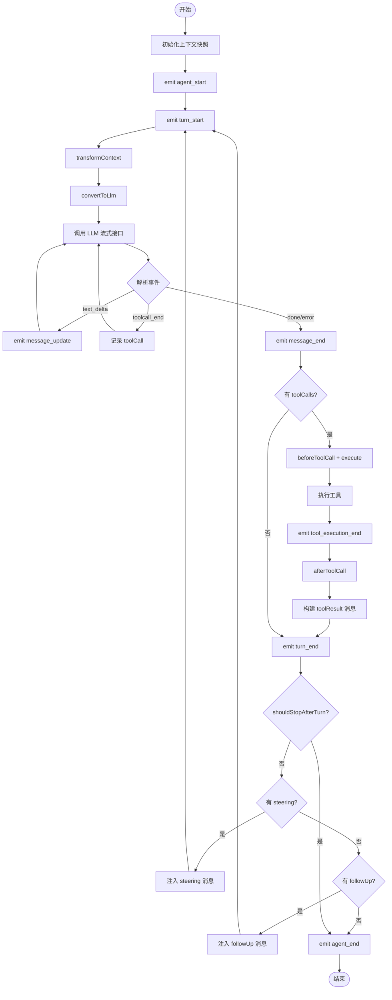
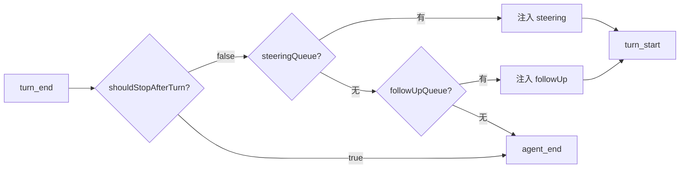
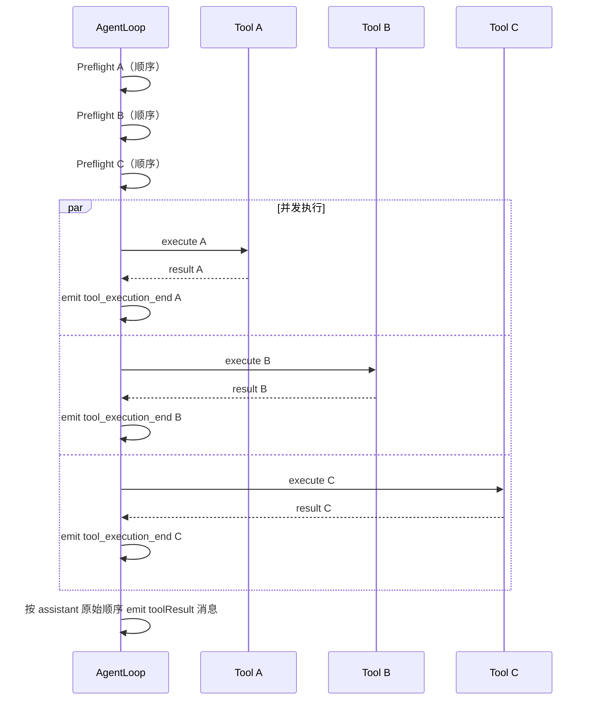
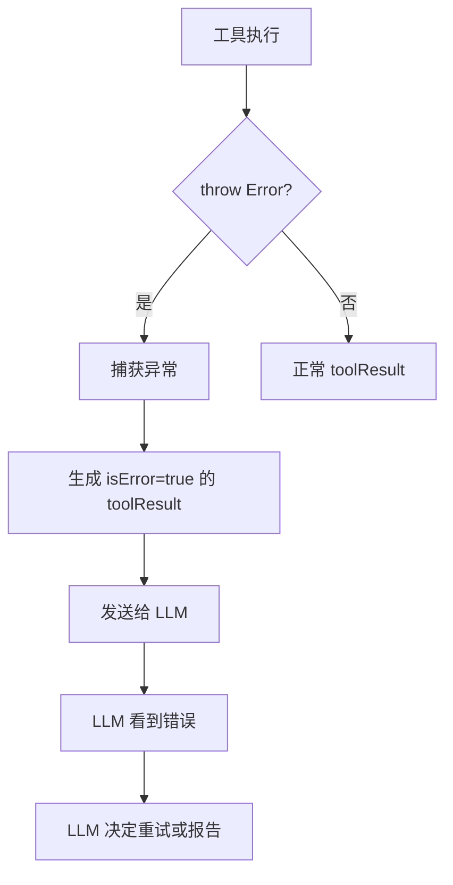

# 05 Agent Loop：思考-行动-观察

> Agent Loop 是 Pi 最核心的机制。它不是一个简单的 `while` 循环，而是一个精心设计的**异步事件生成器**，把 LLM 的“思考”和工具的“行动”编织成连续的对话流。

## 两种使用方式

Pi 提供了两个层级来使用 Agent Loop：

### 高层：Agent 类（推荐）

```ts
import { Agent } from '@earendil-works/pi-agent-core'

const agent = new Agent({ initialState: { ... } })
agent.subscribe((event) => console.log(event.type))
await agent.prompt('Hello')
```

Agent 类帮你管理了：
- 状态生命周期
- 事件订阅与通知
- Steering / Follow-up 队列
- 错误处理与重试

### 低层：agentLoop 函数（完全控制）

```ts
import { agentLoop, agentLoopContinue } from '@earendil-works/pi-agent-core'

const context: AgentContext = {
  systemPrompt: 'You are helpful.',
  messages: [],
  tools: [weatherTool],
}

const config: AgentLoopConfig = {
  model: getModel('openai', 'gpt-4o'),
  convertToLlm: (msgs) => msgs.filter(m => ['user','assistant','toolResult'].includes(m.role)),
  toolExecution: 'parallel',
}

// 新对话
for await (const event of agentLoop([userMessage], context, config)) {
  console.log(event.type)
}

// 从当前上下文继续（用于重试）
for await (const event of agentLoopContinue(context, config)) {
  console.log(event.type)
}
```

低层 API 的特点是**观测性（observational）**：它保证事件顺序，但不会等你处理完一个事件再继续。如果你需要在工具执行前完成某些阻塞操作（比如更新 UI），应该用 Agent 类。

## Loop 的内部结构



## 关键决策点详解

### 1. shouldStopAfterTurn：优雅退出

```ts
const config: AgentLoopConfig = {
  shouldStopAfterTurn: async ({ message, toolResults, context, newMessages }) => {
    // 场景：上下文快满了，停在这里让用户决定
    return estimateTokens(context.messages) > TOKEN_THRESHOLD
  },
}
```

这个钩子运行在 `turn_end` 之后、检查队列之前。返回 `true` 会：
-  emit `agent_end`
-  不检查 steering / follow-up 队列
-  不开始新一轮 LLM 调用

**注意**：它不会中断正在运行的工具或 LLM 流，只是“本轮结束后不再继续”。

### 2. prepareNextTurn：动态调整

```ts
const config: AgentLoopConfig = {
  prepareNextTurn: async () => {
    // 场景：根据当前状态切换模型
    return {
      model: getModel('openai', 'gpt-4o-mini'), // 用便宜模型做简单任务
      thinkingLevel: 'low',
    }
  },
}
```

可以在轮与轮之间更换模型、调整思考深度、甚至替换整个上下文。

### 3. 队列注入时机



**设计意图**：
- Steering 优先级高于 Follow-up，因为用户介入通常更紧急
- 两种队列都支持 `one-at-a-time` 和 `all` 两种消费模式

## 并行 vs 串行工具执行

```ts
// 全局设置
const config: AgentLoopConfig = {
  toolExecution: 'parallel', // 默认
}

// 单个工具覆盖
const slowTool: AgentTool = {
  ...,
  executionMode: 'sequential', // 这个工具强制串行
}
```

**并行模式的执行语义**：



关键点：
- **Preflight 总是顺序执行**：用于参数校验和 `beforeToolCall` hook
- **Execution 可以并发**：节省总耗时
- **事件按完成顺序 emit**：UI 可以实时看到哪个工具先完成
- **toolResult 消息按原始顺序**：保证 LLM 看到的上下文顺序与 assistant 请求一致

## 错误处理与自纠正

Pi 的错误处理设计非常优雅：



示例：

```ts
const fileTool: AgentTool = {
  name: 'read_file',
  parameters: TypeBox.Object({ path: TypeBox.String() }),
  execute: async (toolCallId, params) => {
    if (!fs.existsSync(params.path)) {
      // 直接 throw，Agent 会自动处理
      throw new Error(`File not found: ${params.path}`)
    }
    return { content: [{ type: 'text', text: fs.readFileSync(params.path, 'utf-8') }] }
  },
}
```

LLM 收到错误后的典型回应：

```
[Tool Result] read_file failed: File not found: /tmp/config.json

Let me try a different path...
```

这种设计让**模型自己决定如何纠正**，而不是在外层写一堆重试逻辑。

## continue()：从断点恢复

```ts
// 场景：上一轮因为网络错误失败了
await agent.prompt('Do something complex')
// ... 运行中出错，agent_end 带有 errorMessage

// 不需要重新发送用户消息，直接从当前上下文继续
await agent.continue()
```

**前提条件**：`messages` 数组的最后一个消息必须是 `user` 或 `toolResult`。如果是 `assistant`，LLM 会期望你回传 toolResult，直接继续会导致协议错误。

## 本章小结

- Agent Loop 是**异步生成器**，通过事件流把 LLM 调用和工具执行编织成连续对话。
- 高层 `Agent` 类提供完整生命周期管理；低层 `agentLoop` 提供最大灵活性。
- `shouldStopAfterTurn` 和 `prepareNextTurn` 让你能在轮间做决策和状态调整。
- 并行工具执行在 preflight 阶段顺序、执行阶段并发、结果按原始顺序回传。
- 错误通过 `throw` 抛出，Agent 自动转为 `isError` toolResult，让 LLM 自纠正。

## 常见错误

❌ **在低层 `agentLoop` 里做阻塞 UI 更新**
> 低层 API 是观测性的，不会等你处理完事件再继续。如果 UI 更新是阻塞的，用 `Agent` 类代替。

❌ **`continue()` 时最后一条消息是 assistant**
> 这会导致 LLM 协议错误。确保最后一条是 `user` 或 `toolResult`。

❌ **在 `shouldStopAfterTurn` 里 throw**
> 这个钩子不允许抛异常，否则会中断整个事件序列。返回 `false` 让循环继续。
