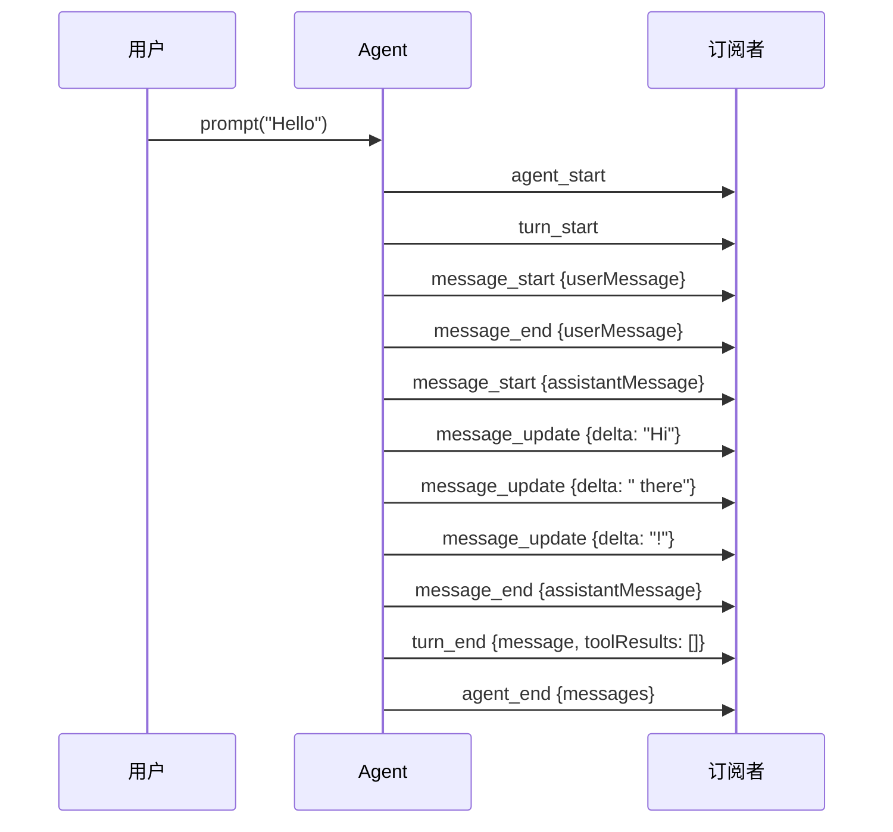
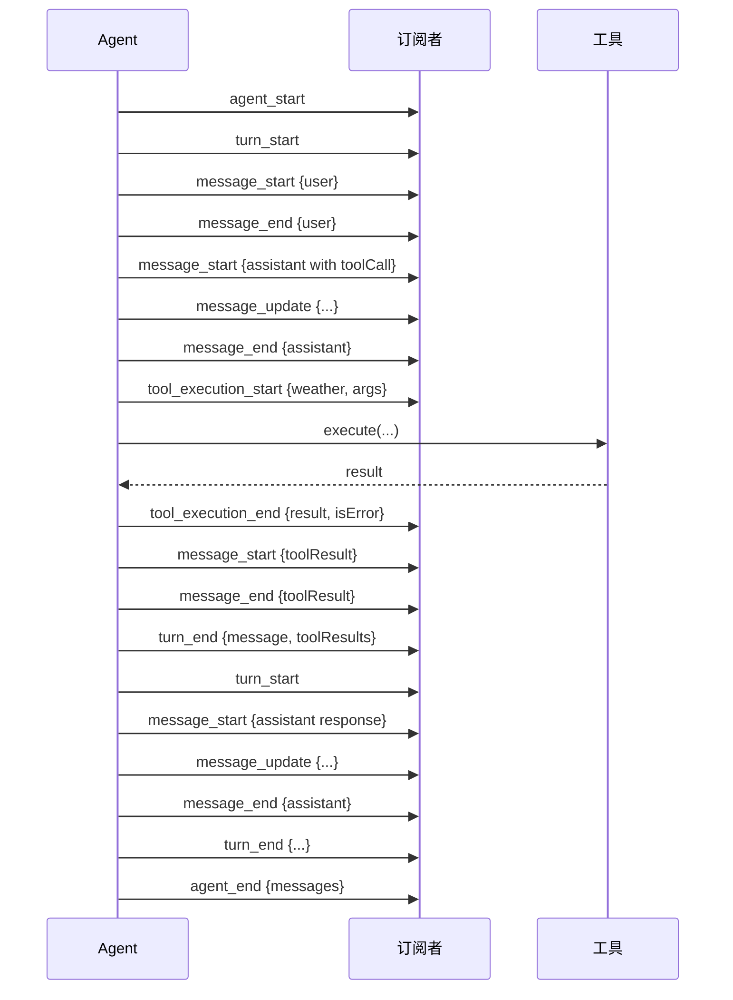
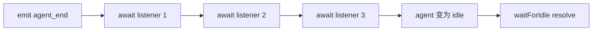

# 06 事件驱动架构

> Pi 的每一个内部状态变化，都会通过标准化事件广播出去。这种设计让 UI、日志、持久化、扩展系统都能以统一的方式“监听”Agent 的运行过程。

## 为什么用事件驱动？

想象你在实现一个聊天界面，需要显示：
- 用户发送的消息
- AI 正在输入的动画
- AI 逐字显示回复
- 工具执行中的进度条
- 工具执行成功/失败的状态图标
- 错误提示

如果没有事件系统，你的代码会变成这样：

```ts
// ❌ 反模式：到处塞回调
const result = await callLLM({
  onToken: (token) => updateUI(token),
  onToolCall: (tool) => {
    showToolProgress(tool.name)
    executeTool(tool).then((res) => {
      updateToolStatus(tool.id, 'done')
      continueLLM(res)
    })
  },
  onError: (err) => showError(err),
})
```

而 Pi 的事件驱动设计让你可以：

```ts
// ✅ 正模式：统一订阅
agent.subscribe((event) => {
  switch (event.type) {
    case 'message_update': appendText(event.assistantMessageEvent.delta); break
    case 'tool_execution_start': showSpinner(event.toolName); break
    case 'tool_execution_end': updateToolStatus(event.toolCallId, event.isError); break
    case 'agent_end': hideLoading(); break
  }
})
```

## 完整事件类型

| 事件 | 触发时机 | 关键字段 |
|------|---------|---------|
| `agent_start` | 运行开始 | - |
| `agent_end` | 运行结束（最后事件） | `messages` |
| `turn_start` | 新一轮 LLM 调用开始 | - |
| `turn_end` | 本轮完成（含工具执行） | `message`, `toolResults` |
| `message_start` | 任意消息开始 | `message` |
| `message_update` | 助手消息流式更新 | `message`, `assistantMessageEvent` |
| `message_end` | 任意消息结束 | `message` |
| `tool_execution_start` | 工具开始执行 | `toolCallId`, `toolName`, `args` |
| `tool_execution_update` | 工具流式输出 | `toolCallId`, `partialResult` |
| `tool_execution_end` | 工具执行结束 | `toolCallId`, `result`, `isError` |

## 事件时序图

### 纯文本对话



### 带工具调用的对话



## 订阅机制详解

```ts
const unsubscribe = agent.subscribe(async (event, signal) => {
  // 1. 监听器按注册顺序执行
  // 2. 支持 async，Agent 会 await 你的 Promise
  // 3. signal 是当前运行的 AbortSignal，可用于取消你的异步操作

  if (event.type === 'agent_end') {
    await saveToDatabase(event.messages) // 即使这里很慢，Agent 也会等
  }
})

// 取消订阅
unsubscribe()
```

**重要语义**：

- **顺序执行**：监听器 A 的 Promise 完成后，才开始监听器 B
- **属于运行结算**：`await agent.waitForIdle()` 会等到所有 `agent_end` 监听器完成
- **收到 signal**：如果你的监听器里有异步 IO，应该用 `signal` 来支持取消



## AgentSession 的扩展事件

在 `pi-coding-agent` 层，事件系统被扩展了：

```ts
type AgentSessionEvent =
  | AgentEvent                          // 基础事件
  | { type: 'agent_end'; messages; willRetry: boolean }
  | { type: 'queue_update'; steering: string[]; followUp: string[] }
  | { type: 'compaction_start'; reason: 'manual' | 'threshold' | 'overflow' }
  | { type: 'compaction_end'; reason; result; aborted; willRetry }
  | { type: 'auto_retry_start'; attempt; maxAttempts; delayMs; errorMessage }
  | { type: 'auto_retry_end'; success; attempt; finalError? }
  | { type: 'thinking_level_changed'; level: ThinkingLevel }
```

这些事件让上层应用可以：
- 显示“正在压缩上下文...”的进度提示
- 在自动重试时展示倒计时
- 实时显示 steering / follow-up 队列长度

## 用事件构建响应式 UI

以下是一个 React 组件如何利用 Pi 事件的伪代码：

```tsx
function Chat() {
  const [messages, setMessages] = useState<AgentMessage[]>([])
  const [isLoading, setIsLoading] = useState(false)
  const [tools, setTools] = useState<Map<string, ToolStatus>>(new Map())

  useEffect(() => {
    const unsubscribe = agent.subscribe((event) => {
      switch (event.type) {
        case 'agent_start':
          setIsLoading(true)
          break

        case 'message_start':
          setMessages(prev => [...prev, event.message])
          break

        case 'message_update':
          if (event.assistantMessageEvent.type === 'text_delta') {
            setMessages(prev => {
              const last = prev[prev.length - 1]
              last.content[0].text += event.assistantMessageEvent.delta
              return [...prev]
            })
          }
          break

        case 'tool_execution_start':
          setTools(prev => new Map(prev).set(event.toolCallId, { name: event.toolName, status: 'running' }))
          break

        case 'tool_execution_end':
          setTools(prev => new Map(prev).set(event.toolCallId, {
            ...prev.get(event.toolCallId)!,
            status: event.isError ? 'error' : 'done',
          }))
          break

        case 'agent_end':
          setIsLoading(false)
          break
      }
    })

    return unsubscribe
  }, [agent])

  return (
    <div>
      {messages.map(m => <MessageBubble key={m.timestamp} message={m} />)}
      {Array.from(tools.entries()).map(([id, t]) => (
        <ToolBadge key={id} name={t.name} status={t.status} />
      ))}
      {isLoading && <TypingIndicator />}
    </div>
  )
}
```

## 事件 vs 回调：设计对比

| 维度 | 事件驱动（Pi） | 回调驱动（传统） |
|------|--------------|----------------|
| 扩展性 | 任意数量订阅者 | 每个点只能挂一个回调 |
| 解耦 | 发布-订阅，完全解耦 | 调用方需知道被调用方 |
| 时序 | 标准化顺序，可追踪 | 容易变成回调地狱 |
| 调试 | 可录制事件日志回放 | 难以复现 |
| 测试 | 断言事件序列即可 | 需要 mock 各种回调 |

## 本章小结

- Pi 用**标准化事件流**替代零散回调，让 Agent 的运行过程完全可观测。
- 事件分为三层：基础 AgentEvent、AssistantMessageEvent（LLM 流）、AgentSessionEvent（会话层扩展）。
- 订阅器按顺序执行、可异步、可取消，是运行结算的一部分。
- 基于事件系统，可以轻松构建响应式 UI、持久化层、日志系统和扩展插件。

## 小练习

设计一个“Agent 运行记录仪”：
1. 订阅所有事件，把事件序列保存到数组
2. 实现 `replay(events, speed)` 函数，以指定速度重放事件
3. 在重放时，UI 应该和真实运行时表现一致

提示：你只需要重放 `message_update`、`tool_execution_start/end` 等事件，不需要真的调用 LLM。
