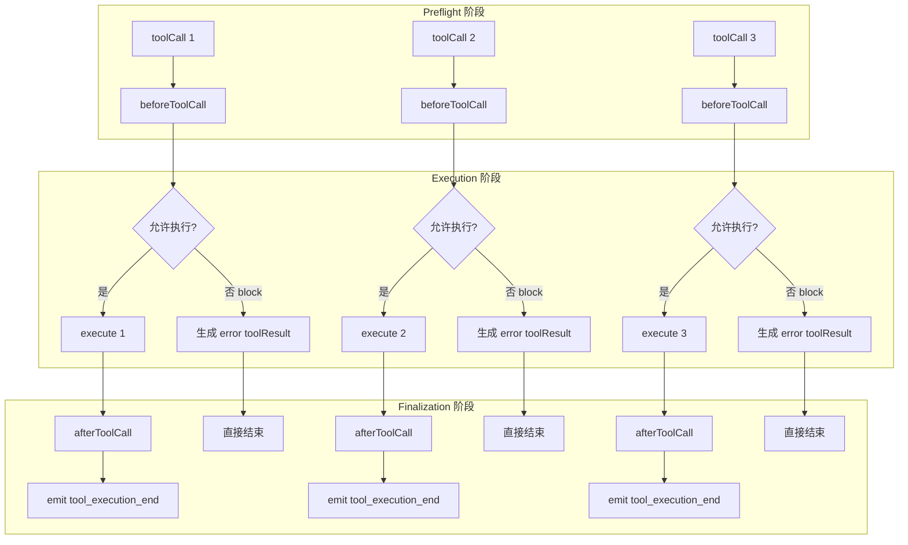

# 07 工具系统与并行执行

> 工具（Tool）是 Agent 的“手”和“眼”。没有工具，LLM 只是一个会说话的百科全书；有了工具，它才能查天气、读文件、执行代码、调用 API。Pi 的工具系统设计得非常精巧，兼顾了安全性、可观测性和性能。

## 工具的定义

```ts
import { Type } from '@sinclair/typebox'

const weatherTool: AgentTool = {
  name: 'weather',
  label: '天气查询',
  description: '查询指定城市的当前天气',
  parameters: Type.Object({
    city: Type.String({ description: '城市名称，如 Beijing' }),
    unit: Type.Optional(Type.Union([
      Type.Literal('celsius'),
      Type.Literal('fahrenheit')
    ]))
  }),
  execute: async (toolCallId, params, signal, onUpdate) => {
    const data = await fetchWeather(params.city, params.unit)
    return {
      content: [{ type: 'text', text: JSON.stringify(data) }],
      details: { apiLatency: data.latency }
    }
  }
}
```

一个完整的工具包含：

| 字段 | 作用 |
|------|------|
| `name` | LLM 调用时使用的标识符，必须唯一 |
| `label` | UI 显示用的人类可读名称 |
| `description` | 告诉 LLM 这个工具是干什么的（Prompt 工程的关键） |
| `parameters` | TypeBox Schema，用于参数校验 |
| `execute` | 实际执行函数 |
| `executionMode` | `parallel`（默认）或 `sequential` |
| `beforeToolCall` / `afterToolCall` | 全局钩子，也可在 Agent 配置中统一设置 |

## Schema 校验：安全第一

Pi 使用 **TypeBox** 做运行时类型校验。为什么不用 Zod？因为 TypeBox 同时生成 JSON Schema，可以直接发给 LLM 作为 `function calling` 的 schema。

```ts
import { Type } from '@sinclair/typebox'

const fileTool = {
  parameters: Type.Object({
    path: Type.String(),
    encoding: Type.Optional(Type.Literal('utf-8'))
  })
}

// LLM 返回的 arguments：{ path: 123 } （类型错误）
// Agent 会自动校验，生成错误 toolResult：
// "Expected string for path, received number"
```

校验失败时，Agent 不会崩溃，而是把错误信息作为 `toolResult` 回传给 LLM，让模型**自己决定如何修正**。

## 执行函数详解

```ts
execute: async (
  toolCallId: string,      // 唯一标识，用于关联 toolResult
  params: Static<TSchema>, // 已校验的参数
  signal?: AbortSignal,    // 取消信号
  onUpdate?: AgentToolUpdateCallback // 流式更新回调
) => Promise<AgentToolResult>
```

### 返回值结构

```ts
interface AgentToolResult<T = any> {
  content: (TextContent | ImageContent)[]  // 给 LLM 看的结果
  details: T                               // 给 UI/日志用的元数据
  terminate?: boolean                       // 是否暗示停止
}
```

**content vs details 的区别**：
- `content`：会被格式化为 `toolResult` 消息发给 LLM，必须是文本或图片
- `details`：不会发给 LLM，适合放调试信息、执行耗时、文件路径等

### 流式更新

对于耗时操作（如长时间运行的 bash 命令），可以用 `onUpdate` 实时报告进度：

```ts
const bashTool: AgentTool = {
  name: 'bash',
  execute: async (id, params, signal, onUpdate) => {
    const proc = spawn('bash', ['-c', params.command])
    let output = ''

    proc.stdout.on('data', (chunk) => {
      output += chunk
      onUpdate?.({
        content: [{ type: 'text', text: output }],
        details: { pid: proc.pid }
      })
    })

    await new Promise((resolve, reject) => {
      proc.on('close', resolve)
      proc.on('error', reject)
      signal?.addEventListener('abort', () => proc.kill())
    })

    return { content: [{ type: 'text', text: output }], details: { exitCode: 0 } }
  }
}
```

每次调用 `onUpdate`，Agent 会 emit `tool_execution_update` 事件，UI 可以实时显示命令输出。

## 并行执行的完整语义



**关键规则**：

1. **Preflight 顺序执行**：即使并行模式，`beforeToolCall` 也是逐个运行的。这保证了钩子可以安全地修改共享状态。
2. **Blocked 工具直接结束**：如果 `beforeToolCall` 返回 `{ block: true }`，不会进入 `execute`，直接生成错误结果。
3. **Completion 顺序 = 执行完成顺序**：`tool_execution_end` 按实际完成时间 emit。
4. **toolResult 消息顺序 = assistant 请求顺序**：无论哪个工具先完成，最终追加到 `messages` 的顺序与 LLM 发出的 `toolCall` 顺序一致。

## beforeToolCall / afterToolCall 钩子

### 使用场景

```ts
const agent = new Agent({
  beforeToolCall: async ({ toolCall, args, context }) => {
    // 场景 1：权限控制
    if (toolCall.name === 'bash' && args.command.includes('rm -rf /')) {
      return { block: true, reason: 'Dangerous command blocked' }
    }

    // 场景 2：审计日志
    console.log(`[AUDIT] ${toolCall.name}(${JSON.stringify(args)})`)

    // 场景 3：参数转换
    if (toolCall.name === 'read_file') {
      args.path = path.resolve(args.path) // 转成绝对路径
    }
  },

  afterToolCall: async ({ toolCall, result, isError, context }) => {
    // 场景 1：结果脱敏
    if (toolCall.name === 'read_file' && args.path.includes('.env')) {
      result.content = [{ type: 'text', text: '[REDACTED]' }]
    }

    // 场景 2：终止信号
    if (toolCall.name === 'notify_done' && !isError) {
      return { terminate: true }
    }

    // 场景 3：附加元数据
    return { details: { ...result.details, audited: true } }
  }
})
```

### terminate 的语义

`terminate: true` 是一个**暗示（hint）**，不是强制命令：

- 只有当**同一个 batch 里所有 finalized 的工具结果**都设置了 `terminate: true` 时，Agent 才会在 toolResult 回传后停止
- 如果 batch 里混合了 `terminate: true` 和 `terminate: false`（或未设置），循环会继续
- 这个设计防止了“某个工具擅自决定停止，但其他工具还在执行”的不一致状态

## 错误处理的最佳实践

```ts
// ✅ 好的做法：throw 让 Agent 处理
execute: async (id, params) => {
  const res = await fetch(params.url)
  if (!res.ok) {
    throw new Error(`HTTP ${res.status}: ${res.statusText}`)
  }
  return { content: [{ type: 'text', text: await res.text() }] }
}

// ❌ 坏的做法：自己返回错误内容
execute: async (id, params) => {
  const res = await fetch(params.url)
  if (!res.ok) {
    return {
      content: [{ type: 'text', text: `Error: ${res.status}` }],
      // 忘记设置 isError，LLM 会以为这是正常结果
    }
  }
}
```

## 工具注册表模式

在实际项目中，你通常会有多个工具。推荐用一个注册表管理：

```ts
class ToolRegistry {
  private tools = new Map<string, AgentTool>()

  register(tool: AgentTool) {
    this.tools.set(tool.name, tool)
  }

  get(name: string): AgentTool | undefined {
    return this.tools.get(name)
  }

  getAll(): AgentTool[] {
    return Array.from(this.tools.values())
  }

  getDefinitions(): Tool[] {
    return this.getAll().map(t => ({
      name: t.name,
      description: t.description,
      parameters: t.parameters,
    }))
  }
}

// 使用
const registry = new ToolRegistry()
registry.register(weatherTool)
registry.register(fileTool)
registry.register(bashTool)

const agent = new Agent({
  initialState: { tools: registry.getAll() }
})
```

## 本章小结

- 工具 = Schema + 执行函数 + 执行模式 + 生命周期钩子。
- TypeBox Schema 同时服务于“LLM 的 function calling”和“运行时的参数校验”。
- 并行执行在 preflight 阶段顺序、execution 阶段并发、finalization 按完成顺序 emit 事件。
- `throw Error` 是工具报告错误的推荐方式，Agent 会自动转为 `isError` toolResult。
- `beforeToolCall` / `afterToolCall` 提供了拦截、审计、转换、终止等扩展点。

## 小练习

实现一个 `safeBash` 工具，要求：
1. 使用 TypeBox Schema 定义参数：`command: string`, `timeoutMs?: number`
2. `beforeToolCall` 里检查命令是否在白名单内（只允许 `ls`, `cat`, `pwd`, `echo`）
3. `execute` 里用 `child_process.spawn` 执行，支持 `signal` 取消和 `onUpdate` 流式输出
4. 如果命令执行超时，throw 一个 `TimeoutError`
5. `afterToolCall` 里记录命令执行耗时到 `details`
