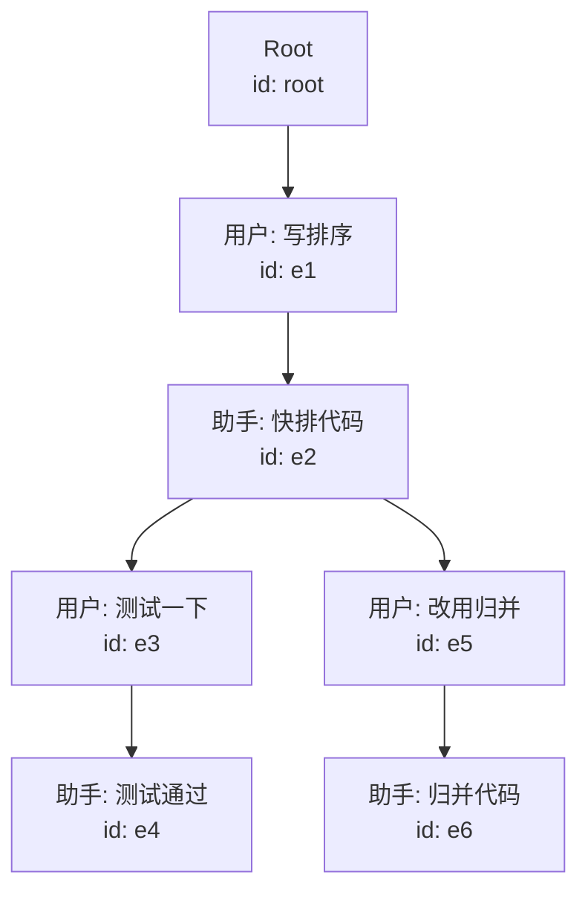
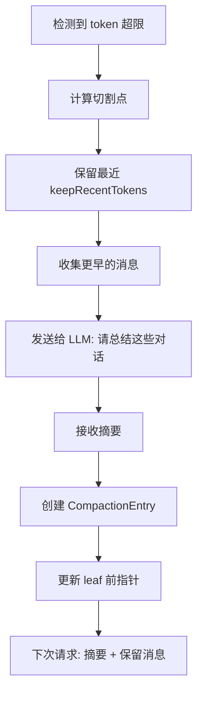
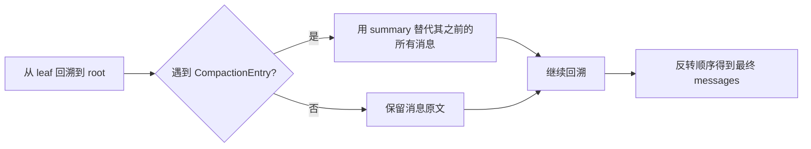
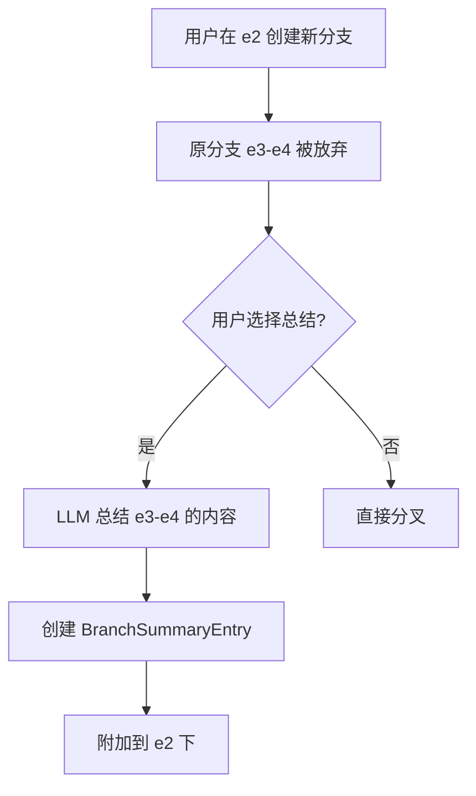

# 08 会话树与上下文压缩

> 人类可以聊几个小时不遗忘，但 LLM 的“记忆”受限于上下文窗口。Pi 用**树形会话**和**自动压缩**解决了这个问题，而且设计得非常优雅。

## 会话树：对话的 Git

### 线性历史的局限

传统聊天应用的历史是这样的：

```
消息1 → 消息2 → 消息3 → 消息4 → ...
```

一旦你想“回到消息 2 换个思路”，只能：
- 复制粘贴旧消息开新对话（丢失上下文）
- 或者把历史全删掉重来（更糟）

### Pi 的树形结构

Pi 的每个会话 entry 都有 `id` 和 `parentId`：



**操作语义**：

| 操作 | 效果 |
|------|------|
| `appendMessage()` | 在当前 leaf 下创建子节点，leaf 前移 |
| `branch(e2)` | 把 leaf 移到 e2，下次 append 会创建 e2 的新子节点 |
| `getBranch()` | 从 leaf 回溯到 root，返回路径上的所有 entry |
| `getTree()` | 返回完整的树结构，用于 UI 展示 |

### JSONL 文件格式

```jsonl
{"type":"session","id":"sess-001","timestamp":"2026-01-15T10:00:00Z","cwd":"/project"}
{"type":"message","id":"e1","parentId":null,"timestamp":"...","message":{"role":"user","content":"写个排序函数"}}
{"type":"message","id":"e2","parentId":"e1","timestamp":"...","message":{"role":"assistant","content":"..."}}
{"type":"message","id":"e3","parentId":"e2","timestamp":"...","message":{"role":"user","content":"测试一下"}}
{"type":"message","id":"e4","parentId":"e3","timestamp":"...","message":{"role":"assistant","content":"测试通过"}}
{"type":"message","id":"e5","parentId":"e2","timestamp":"...","message":{"role":"user","content":"改用归并排序"}}
{"type":"message","id":"e6","parentId":"e5","timestamp":"...","message":{"role":"assistant","content":"..."}}
```

**设计优势**：
- **追加 only**：不需要修改旧数据，文件 IO 简单且安全
- **天然分支**：`parentId` 直接表达树关系
- **永不丢失**：即使压缩了上下文，原始 entry 仍在文件中

## 上下文压缩（Compaction）

### 为什么要压缩？

假设上下文窗口是 128K tokens，对话已经用了 100K：
- LLM 的回复可能又占 20K
- 如果继续追加，请求会失败（context overflow）

传统做法是粗暴地删掉旧消息，但会丢失信息。Pi 的做法是**让 LLM 自己总结旧消息**。

### 压缩流程



### CompactionEntry 结构

```ts
interface CompactionEntry {
  type: 'compaction'
  id: string
  parentId: string
  timestamp: string
  summary: string           // LLM 生成的摘要
  firstKeptEntryId: string  // 从哪个 entry 开始保留原文
  tokensBefore: number      // 压缩前的 token 数（用于统计）
  details?: unknown         // 扩展数据（如文件操作追踪）
}
```

### buildSessionContext 的解析逻辑

当 SessionManager 构建发给 LLM 的上下文时：



示例：

```
原始分支: Root → e1 → e2 → e3 → Compaction → e4 → e5
                                ↑ summary of e1-e3

构建结果: [summary] → e4 → e5
```

### 文件操作追踪

压缩有一个微妙的问题：如果早期对话里 Agent 读了 `config.json`，压缩后这条消息变成了摘要，LLM 可能忘记这个文件被修改过。

Pi 的解决方案是在 `details` 里**累积追踪文件操作**：

```ts
interface CompactionDetails {
  filesRead: string[]
  filesModified: string[]
}
```

每次压缩时，把被压缩段落的文件操作合并到新的 `CompactionEntry` 中。这样即使消息被压缩了，文件状态仍然可追溯。

## 分支摘要（Branch Summarization）

当你用 `/tree` 导航到历史节点时，Pi 会询问是否总结被放弃的分支：



`BranchSummaryEntry` 的结构：

```ts
interface BranchSummaryEntry {
  type: 'branch_summary'
  id: string
  parentId: string
  fromId: string       // 从哪个节点分叉的
  summary: string
  details?: unknown
}
```

这样当你之后回到 e2 时，可以看到：“从这里曾有一个分支，讨论了测试相关的内容...”

## 自动压缩 vs 手动压缩

| 触发方式 | 时机 | 用途 |
|---------|------|------|
| 自动 | token 接近上限，或请求因 overflow 失败 | 保持对话流畅进行 |
| 手动 `/compact` | 用户主动触发 | 精确控制，可附加自定义指令 |

手动压缩示例：

```
/compact 重点保留关于数据库设计的讨论，其他可以简略带过
```

自定义指令会被附加到压缩 prompt 中，让 LLM 按你的偏好生成摘要。

## 配置参数

```ts
const DEFAULT_COMPACTION_SETTINGS = {
  enabled: true,
  reserveTokens: 16384,     // 为 LLM 回复预留的 token
  keepRecentTokens: 20000,  // 保留不压缩的近期消息 token 数
}
```

**reserveTokens 的重要性**：
- 如果上下文窗口是 200K，已用 180K
- 不预留的话，LLM 可能只能回复 1 个 token 就触顶
- 预留 16K 确保 LLM 有空间生成完整回复

## 本章小结

- Pi 用 **JSONL + id/parentId** 实现追加-only 的会话树，支持任意分叉和回溯。
- **Compaction** 让 LLM 自己总结旧消息，用摘要替代详细历史，控制 token 用量。
- **Branch Summarization** 在分叉时总结被放弃的分支，避免信息丢失。
- 文件操作等关键元数据通过 `details` 字段累积追踪，跨越压缩边界。

## 常见错误

❌ **以为压缩会删除原始消息**
> 压缩只影响 `buildSessionContext()` 的结果，原始 entry 永远留在 JSONL 文件中。你可以用 `/tree` 回到任何历史节点查看原文。

❌ **在压缩后立即检查 messages 长度**
> `compact()` 是异步操作，且会触发会话重载。应该在 `compaction_end` 事件后再读取状态。

## 小练习

实现一个简化版 `SessionManager`：
1. 用内存数组存储 entry，支持 `appendMessage` 和 `branch`
2. 实现 `buildSessionContext()`，能处理 `CompactionEntry`
3. 实现 `compact(keepRecent: number)`：保留最近 N 条消息，让 LLM 总结更早的消息（这里用 mock LLM）
4. 验证：压缩后 `buildSessionContext()` 返回的消息数是否减少，但内容语义是否保留
