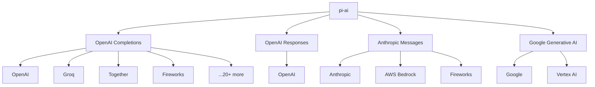
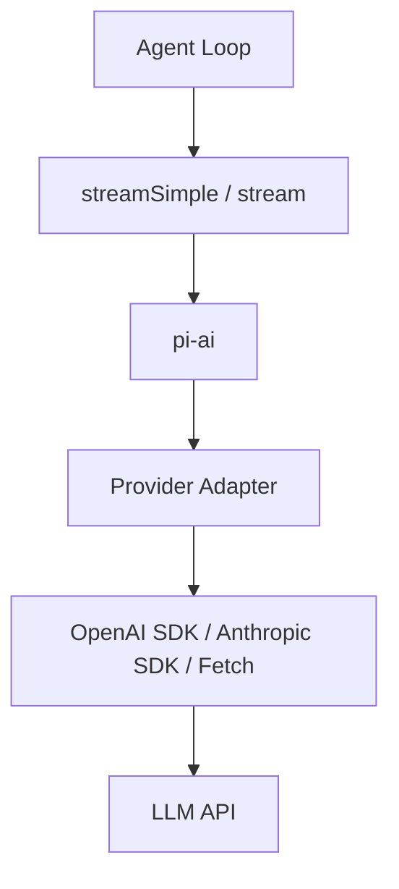

# 09 LLM 抽象层 pi-ai

> `pi-ai` 是 Pi 的底层 LLM 通信库。它的设计非常精妙：用**四种协议**覆盖**三十多家提供商**、**三百多个模型**，同时保持类型安全和流式一致性。

## 为什么需要抽象层？

直接调用 OpenAI SDK 的代码：

```ts
import OpenAI from 'openai'
const openai = new OpenAI({ apiKey: '...' })
const stream = await openai.chat.completions.create({ model: 'gpt-4o', messages, stream: true })
```

换到 Anthropic：

```ts
import Anthropic from '@anthropic-ai/sdk'
const anthropic = new Anthropic({ apiKey: '...' })
const stream = await anthropic.messages.create({ model: 'claude-3-5-sonnet', messages, stream: true })
// 事件格式完全不同！需要重新解析
```

每支持一家提供商，就要写一套适配代码。而 Pi 的 `pi-ai` 发现：**几乎所有提供商的 API 都可以归类为四种协议之一**。

## 四种协议

| 协议 | 代表提供商 | 特点 |
|------|-----------|------|
| **OpenAI Completions** | OpenAI, Azure, Groq, Together, Fireworks... | 最广泛的兼容标准 |
| **OpenAI Responses** | OpenAI (新 API) | 支持推理内容、搜索等 |
| **Anthropic Messages** | Anthropic, Bedrock, Fireworks | 支持 thinking 块、工具流 |
| **Google Generative AI** | Google, Vertex AI | 内容结构差异较大 |



## 统一的事件流

无论底层用哪种协议，`pi-ai` 都把它们转换成统一的事件流：

```ts
type AssistantMessageEvent =
  | { type: 'start'; partial: AssistantMessage }
  | { type: 'text_start'; contentIndex: number; partial: AssistantMessage }
  | { type: 'text_delta'; contentIndex: number; delta: string; partial: AssistantMessage }
  | { type: 'text_end'; contentIndex: number; content: string; partial: AssistantMessage }
  | { type: 'thinking_start'; contentIndex: number; partial: AssistantMessage }
  | { type: 'thinking_delta'; contentIndex: number; delta: string; partial: AssistantMessage }
  | { type: 'thinking_end'; contentIndex: number; content: string; partial: AssistantMessage }
  | { type: 'toolcall_start'; contentIndex: number; partial: AssistantMessage }
  | { type: 'toolcall_delta'; contentIndex: number; delta: string; partial: AssistantMessage }
  | { type: 'toolcall_end'; contentIndex: number; toolCall: ToolCall; partial: AssistantMessage }
  | { type: 'done'; reason: 'stop' | 'length' | 'toolUse'; message: AssistantMessage }
  | { type: 'error'; reason: 'aborted' | 'error'; error: AssistantMessage }
```

这意味着：**上层代码完全不需要关心底层是 OpenAI 还是 Anthropic**。

## Model 类型

```ts
interface Model<TApi extends Api> {
  id: string           // 模型 ID，如 'gpt-4o'
  name: string         // 显示名称
  api: TApi            // 协议类型
  provider: Provider   // 提供商
  baseUrl: string      // API 基础地址
  reasoning: boolean   // 是否支持推理
  thinkingLevelMap?: ThinkingLevelMap  // 思考级别映射
  input: ('text' | 'image')[]
  cost: { input: number; output: number; cacheRead: number; cacheWrite: number }
  contextWindow: number
  maxTokens: number
  compat?: OpenAICompletionsCompat | AnthropicMessagesCompat | ...
}
```

**thinkingLevelMap** 是一个巧妙的设计：

不同提供商对“思考深度”的表示不同：
- OpenAI: `reasoning_effort: 'low' | 'medium' | 'high'`
- Anthropic: `thinking: { type: 'enabled', budget_tokens: 1024 }`
- DeepSeek: `thinking: { type: 'enabled' }` + `reasoning_effort`

`thinkingLevelMap` 把 Pi 的通用级别（`minimal/low/medium/high/xhigh`）映射到提供商特定值：

```ts
const claudeModel: Model = {
  ...,
  thinkingLevelMap: {
    minimal: null,      // 不支持 minimal
    low: 'low',
    medium: 'medium',
    high: 'high',
    xhigh: null,        // 不支持 xhigh
  }
}
```

## 流式接口

```ts
import { streamSimple, completeSimple } from '@earendil-works/pi-ai'

// 流式：返回异步迭代器
const eventStream = streamSimple(model, {
  systemPrompt: 'You are helpful.',
  messages: [{ role: 'user', content: 'Hello', timestamp: Date.now() }],
  tools: [weatherTool],
})

for await (const event of eventStream) {
  if (event.type === 'text_delta') {
    process.stdout.write(event.delta)
  }
  if (event.type === 'toolcall_end') {
    console.log('Tool called:', event.toolCall.name)
  }
}

// 非流式：直接返回完整结果
const message = await completeSimple(model, context)
console.log(message.content)
```

## 兼容性配置

Pi 用 `compat` 字段处理各家提供商的怪癖：

```ts
// OpenAI 兼容提供商的特殊处理
interface OpenAICompletionsCompat {
  supportsStore?: boolean
  supportsDeveloperRole?: boolean    // system vs developer
  supportsReasoningEffort?: boolean
  maxTokensField?: 'max_completion_tokens' | 'max_tokens'
  requiresToolResultName?: boolean
  requiresAssistantAfterToolResult?: boolean
  requiresThinkingAsText?: boolean
  thinkingFormat?: 'openai' | 'openrouter' | 'deepseek' | ...
  supportsStrictMode?: boolean
  cacheControlFormat?: 'anthropic'
}
```

这些配置大多是**自动检测**的（根据 `baseUrl` 判断），但也可以手动覆盖。

## 与 Agent Core 的关系



Agent Core 不直接调用 HTTP，而是通过 `StreamFn` 类型注入流函数：

```ts
type StreamFn = (
  model: Model,
  context: Context,
  options?: SimpleStreamOptions
) => AssistantMessageEventStream
```

默认使用 `streamSimple`，但你可以替换：

```ts
// 代理到后端（浏览器场景）
const agent = new Agent({
  streamFn: (model, context, options) =>
    streamProxy(model, context, {
      ...options,
      authToken: '...',
      proxyUrl: 'https://your-server.com',
    }),
})
```

## 本章小结

- `pi-ai` 用**四种协议**统一了**三十多家提供商**的 API 差异。
- 所有提供商都被归一化为统一的 `AssistantMessageEvent` 流。
- `Model` 类型包含完整的元数据（成本、上下文窗口、兼容性配置）。
- `thinkingLevelMap` 优雅地解决了不同提供商的推理级别表示差异。
- Agent Core 通过 `StreamFn` 注入流函数，保持与具体 LLM 实现的解耦。

## 小练习

实现一个自定义 `StreamFn`，要求：
1. 接收 `model` 和 `context`
2. 如果 `model.provider === 'mock'`，直接返回一个模拟的事件流（生成 5 个 `text_delta` 然后 `done`）
3. 否则调用真实的 `streamSimple`
4. 在 Agent 中使用这个 `StreamFn`，验证 mock 模式下无需真实 API key 也能运行
