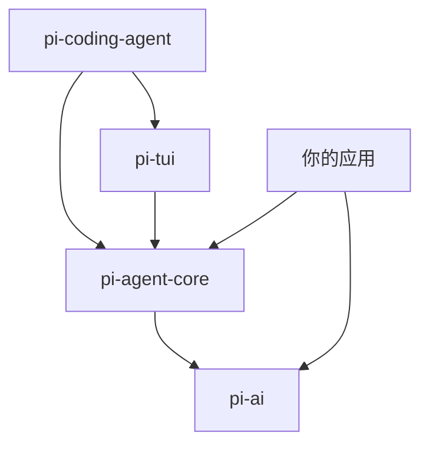

# 10 代码目录与模块关系

> 这一章我们把视角拉高，看看 Pi 的 monorepo 是如何组织的，各个包之间如何协作，以及我们教学版项目应该保留哪些、简化哪些。

## Pi 的 Monorepo 结构

```
pi/
├── packages/
│   ├── pi-ai/              # LLM 抽象层
│   │   ├── src/
│   │   │   ├── stream.ts       # streamSimple, completeSimple
│   │   │   ├── types.ts        # Model, Message, Event 类型
│   │   │   ├── providers/      # 各提供商适配器
│   │   │   │   ├── openai.ts
│   │   │   │   ├── anthropic.ts
│   │   │   │   ├── google.ts
│   │   │   │   └── register-builtins.ts
│   │   │   └── utils/
│   │   │       └── event-stream.ts  # EventStream 实现
│   │   └── package.json
│   │
│   ├── pi-agent-core/      # Agent 运行时核心
│   │   ├── src/
│   │   │   ├── agent.ts          # Agent 类（高层 API）
│   │   │   ├── agent-loop.ts     # agentLoop, agentLoopContinue（低层 API）
│   │   │   ├── types.ts          # AgentState, AgentTool, AgentEvent 等
│   │   │   ├── proxy.ts          # streamProxy（浏览器代理）
│   │   │   └── harness/          # AgentSession 的辅助逻辑
│   │   │       ├── agent-harness.ts
│   │   │       └── compaction/
│   │   └── package.json
│   │
│   ├── pi-coding-agent/    # 完整 CLI 产品
│   │   ├── src/
│   │   │   ├── core/
│   │   │   │   ├── agent-session.ts      # AgentSession 类
│   │   │   │   ├── session-manager.ts    # SessionManager（JSONL 树）
│   │   │   │   ├── compaction/
│   │   │   │   │   ├── compaction.ts
│   │   │   │   │   └── branch-summarization.ts
│   │   │   │   ├── extensions/           # 扩展系统
│   │   │   │   ├── tools/                # 内置工具（read, write, edit, bash）
│   │   │   │   └── ...
│   │   │   ├── modes/
│   │   │   │   ├── interactive.ts        # TUI 模式
│   │   │   │   ├── print.ts              # Print/JSON 模式
│   │   │   │   └── rpc.ts                # RPC 模式
│   │   │   └── cli.ts                    # 入口
│   │   └── package.json
│   │
│   └── pi-tui/             # 终端 UI 组件
│       └── src/
│           └── ...
│
├── docs/                   # 官方文档（pi.dev）
└── package.json            # workspace root
```

## 模块依赖关系



- **`pi-ai`** 是最底层，只依赖 HTTP 客户端和 TypeBox
- **`pi-agent-core`** 依赖 `pi-ai`，提供 Agent 循环和事件系统
- **`pi-coding-agent`** 依赖前两者，加上文件系统、终端 UI、配置管理等
- **`pi-tui`** 依赖 `pi-agent-core`，提供终端渲染组件

## 教学版项目的取舍

我们的目标是**保留核心思想，去除生产噪音**。以下是取舍策略：

| Pi 功能 | 教学版处理 | 理由 |
|---------|-----------|------|
| 30+ LLM 提供商 | 只保留 OpenAI 兼容协议 | 理解原理即可，无需适配所有怪癖 |
| Terminal UI | 替换为 React Web UI | 更贴近现代开发者习惯 |
| JSONL 文件持久化 | 简化为内存存储 + 可选 JSON 导出 | 降低文件 IO 复杂度 |
| 扩展系统 | 暂不实现 | 先掌握核心，再学扩展 |
| Skills / Prompt Templates | 暂不实现 | 属于产品层，非核心机制 |
| Bash 工具 | 替换为 `fetch` / `calculator` 等安全工具 | 避免本地命令执行风险 |
| 自动 Compaction | 保留核心逻辑，简化触发条件 | 这是 Agent 的关键能力 |
| Steering / Follow-up | 完整保留 | 体现 Agent 的人机协作设计 |
| 并行工具执行 | 完整保留 | 体现并发控制设计 |

## 教学版项目结构

```
pi-agent-tutorial/
├── docs/                       # VitePress 教程站点（本教程）
│   ├── .vitepress/
│   ├── guide/
│   ├── demos/
│   └── project/
│
└── playground/                 # 可运行的教学代码
    ├── backend/
    │   ├── src/
    │   │   ├── core/
    │   │   │   ├── agent-loop.ts      # 简化版 Agent Loop
    │   │   │   ├── agent.ts           # 简化版 Agent 类
    │   │   │   ├── types.ts           # 核心类型定义
    │   │   │   └── tool-registry.ts   # 工具注册表
    │   │   ├── llm/
    │   │   │   ├── openai-client.ts   # OpenAI 兼容客户端
    │   │   │   └── mock-client.ts     # Mock 客户端（无需 API key）
    │   │   ├── session/
    │   │   │   ├── session-manager.ts # 简化版会话管理
    │   │   │   └── compaction.ts      # 简化版压缩
    │   │   ├── api/
    │   │   │   ├── server.ts          # Express / Fastify 服务器
    │   │   │   └── sse.ts             # SSE 流式端点
    │   │   └── index.ts               # 入口
    │   ├── package.json
    │   └── tsconfig.json
    │
    └── frontend/
        ├── src/
        │   ├── components/
        │   │   ├── Chat.tsx             # 聊天主界面
        │   │   ├── MessageBubble.tsx    # 消息气泡
        │   │   ├── ToolCard.tsx         # 工具执行卡片
        │   │   └── TypingIndicator.tsx  # 输入动画
        │   ├── hooks/
        │   │   ├── useAgent.ts          # Agent 连接 hook
        │   │   └── useEventSource.ts    # SSE 封装
        │   ├── types/
        │   │   └── events.ts            # 前端事件类型
        │   ├── App.tsx
        │   └── main.tsx
        ├── package.json
        └── vite.config.ts
```

## 核心文件对应关系

| Pi 原文件 | 教学版对应 | 说明 |
|----------|-----------|------|
| `pi-ai/src/stream.ts` | `backend/src/llm/openai-client.ts` | 流式 LLM 调用 |
| `pi-ai/src/types.ts` | `backend/src/core/types.ts` | 消息和模型类型 |
| `pi-agent-core/src/agent-loop.ts` | `backend/src/core/agent-loop.ts` | Agent 循环 |
| `pi-agent-core/src/agent.ts` | `backend/src/core/agent.ts` | Agent 类 |
| `pi-agent-core/src/types.ts` | `backend/src/core/types.ts` | Agent 工具、事件类型 |
| `pi-coding-agent/src/core/session-manager.ts` | `backend/src/session/session-manager.ts` | 会话树 |
| `pi-coding-agent/src/core/compaction/compaction.ts` | `backend/src/session/compaction.ts` | 上下文压缩 |

## 阅读源码的建议顺序

如果你想深入 Pi 的原始源码，建议按这个顺序：

1. **`pi-ai/src/types.ts`** → 理解消息模型和事件协议
2. **`pi-ai/src/stream.ts`** → 看流式接口如何统一不同提供商
3. **`pi-agent-core/src/types.ts`** → 理解 Agent 层扩展的类型
4. **`pi-agent-core/src/agent-loop.ts`** → 核心循环逻辑（最重要）
5. **`pi-agent-core/src/agent.ts`** → 看高层如何包装低层
6. **`pi-coding-agent/src/core/session-manager.ts`** → 会话树实现
7. **`pi-coding-agent/src/core/compaction/compaction.ts`** → 压缩逻辑

## 本章小结

- Pi 是 monorepo 结构，四层架构清晰：pi-ai → pi-agent-core → pi-coding-agent → pi-tui。
- 教学版保留核心机制（Loop、事件、工具、会话、压缩），替换表现层（TUI → React Web）。
- 阅读源码建议从类型定义入手，再深入循环逻辑，最后看会话管理。

## 小练习

在 GitHub 上打开 [earendil-works/pi](https://github.com/earendil-works/pi)，找到以下代码位置：
1. `agentLoop` 函数中，处理 `toolcall_end` 事件后、调用 `execute` 之前的代码
2. `Agent` 类中，`subscribe` 方法如何确保监听器按顺序执行
3. `SessionManager` 中，`buildSessionContext` 如何处理 `CompactionEntry`

试着回答：如果要在 `agentLoop` 里添加一个“每轮开始前打印日志”的功能，应该在哪个位置插入代码？
