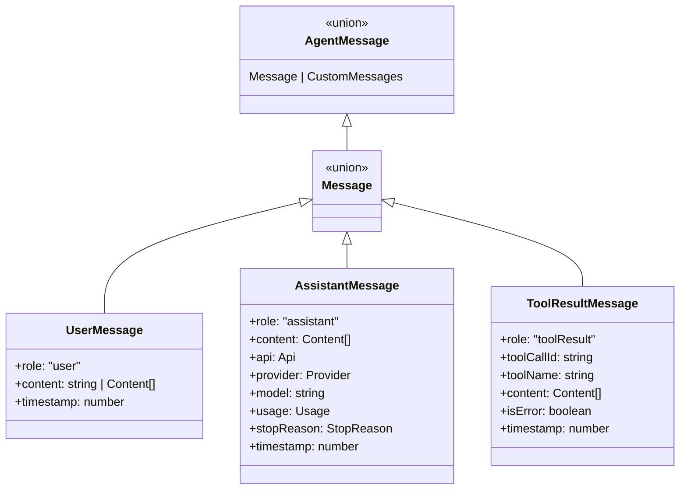
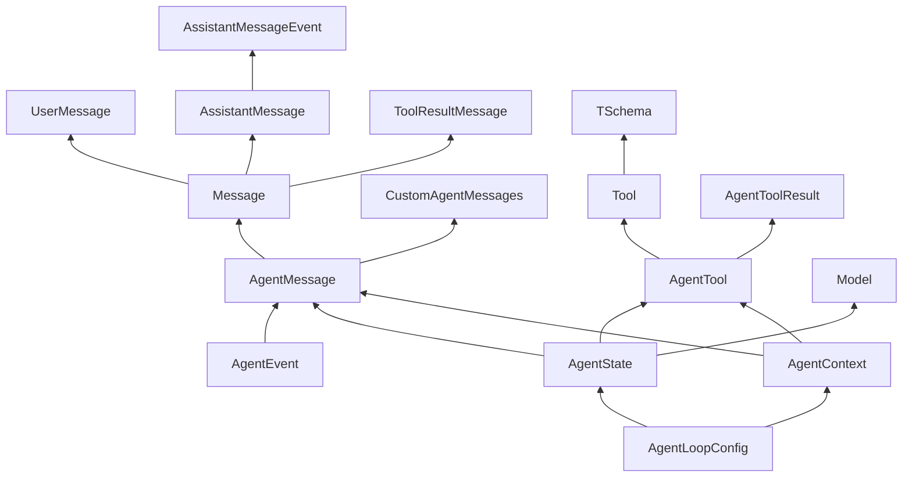

# 11 关键类型与接口

> 这一章是原理篇的收官。我们把 Pi 中最核心的类型和接口汇总在一起，作为你阅读源码和实现教学版项目的速查表。

## 消息类型体系



## 核心接口速查

### LLM 层（pi-ai）

```ts
// 模型定义
interface Model<TApi extends Api> {
  id: string
  name: string
  api: TApi
  provider: Provider
  baseUrl: string
  reasoning: boolean
  input: ('text' | 'image')[]
  cost: { input: number; output: number; cacheRead: number; cacheWrite: number }
  contextWindow: number
  maxTokens: number
  compat?: OpenAICompletionsCompat | AnthropicMessagesCompat | OpenAIResponsesCompat
}

// 上下文
interface Context {
  systemPrompt?: string
  messages: Message[]
  tools?: Tool[]
}

// 工具定义（LLM 可见部分）
interface Tool<TParameters extends TSchema> {
  name: string
  description: string
  parameters: TParameters
}

// 流式选项
interface SimpleStreamOptions extends StreamOptions {
  reasoning?: ThinkingLevel
  thinkingBudgets?: ThinkingBudgets
}
```

### Agent 层（pi-agent-core）

```ts
// Agent 状态
interface AgentState {
  systemPrompt: string
  model: Model<any>
  thinkingLevel: ThinkingLevel
  tools: AgentTool[]
  messages: AgentMessage[]
  readonly isStreaming: boolean
  readonly streamingMessage?: AgentMessage
  readonly pendingToolCalls: ReadonlySet<string>
  readonly errorMessage?: string
}

// Agent 工具（扩展了 execute）
interface AgentTool<TParameters extends TSchema = TSchema, TDetails = any> extends Tool<TParameters> {
  label: string
  prepareArguments?: (args: unknown) => Static<TParameters>
  execute: (toolCallId: string, params: Static<TParameters>, signal?: AbortSignal, onUpdate?: AgentToolUpdateCallback<TDetails>) => Promise<AgentToolResult<TDetails>>
  executionMode?: ToolExecutionMode
}

// 工具执行结果
interface AgentToolResult<T> {
  content: (TextContent | ImageContent)[]
  details: T
  terminate?: boolean
}

// Agent 上下文（传给 loop）
interface AgentContext {
  systemPrompt: string
  messages: AgentMessage[]
  tools?: AgentTool[]
}

// Agent 循环配置
interface AgentLoopConfig extends SimpleStreamOptions {
  model: Model<any>
  convertToLlm: (messages: AgentMessage[]) => Message[] | Promise<Message[]>
  transformContext?: (messages: AgentMessage[], signal?: AbortSignal) => Promise<AgentMessage[]>
  shouldStopAfterTurn?: (context: ShouldStopAfterTurnContext) => boolean | Promise<boolean>
  prepareNextTurn?: (context: PrepareNextTurnContext) => AgentLoopTurnUpdate | undefined | Promise<...>
  getSteeringMessages?: () => Promise<AgentMessage[]>
  getFollowUpMessages?: () => Promise<AgentMessage[]>
  toolExecution?: ToolExecutionMode
  beforeToolCall?: (context: BeforeToolCallContext, signal?: AbortSignal) => Promise<BeforeToolCallResult | undefined>
  afterToolCall?: (context: AfterToolCallContext, signal?: AbortSignal) => Promise<AfterToolCallResult | undefined>
}
```

### 事件类型

```ts
type AgentEvent =
  | { type: 'agent_start' }
  | { type: 'agent_end'; messages: AgentMessage[] }
  | { type: 'turn_start' }
  | { type: 'turn_end'; message: AgentMessage; toolResults: ToolResultMessage[] }
  | { type: 'message_start'; message: AgentMessage }
  | { type: 'message_update'; message: AgentMessage; assistantMessageEvent: AssistantMessageEvent }
  | { type: 'message_end'; message: AgentMessage }
  | { type: 'tool_execution_start'; toolCallId: string; toolName: string; args: any }
  | { type: 'tool_execution_update'; toolCallId: string; toolName: string; args: any; partialResult: any }
  | { type: 'tool_execution_end'; toolCallId: string; toolName: string; result: any; isError: boolean }
```

### 会话层（pi-coding-agent）

```ts
// 会话 Entry 类型
interface SessionEntryBase {
  type: string
  id: string
  parentId: string | null
  timestamp: string
}

interface SessionMessageEntry extends SessionEntryBase {
  type: 'message'
  message: AgentMessage
}

interface CompactionEntry<T = unknown> extends SessionEntryBase {
  type: 'compaction'
  summary: string
  firstKeptEntryId: string
  tokensBefore: number
  details?: T
}

interface BranchSummaryEntry<T = unknown> extends SessionEntryBase {
  type: 'branch_summary'
  fromId: string
  summary: string
  details?: T
}

type SessionEntry = SessionMessageEntry | ThinkingLevelChangeEntry | ModelChangeEntry | CompactionEntry | BranchSummaryEntry | CustomEntry | CustomMessageEntry | LabelEntry | SessionInfoEntry

// SessionManager
class SessionManager {
  appendMessage(message: Message): string
  appendCompaction(summary: string, firstKeptEntryId: string, tokensBefore: number): string
  branch(branchFromId: string): void
  buildSessionContext(): SessionContext
  getTree(): SessionTreeNode[]
  static create(cwd: string): SessionManager
  static open(path: string): SessionManager
  static inMemory(cwd?: string): SessionManager
}
```

## 类型设计亮点

### 1. 声明合并扩展自定义消息

```ts
// 在你的项目里
declare module '@earendil-works/pi-agent-core' {
  interface CustomAgentMessages {
    notification: { role: 'notification'; text: string; timestamp: number }
    artifact: { role: 'artifact'; artifactId: string; content: string; timestamp: number }
  }
}

// 现在可以直接使用
const msg: AgentMessage = { role: 'notification', text: 'User is typing...', timestamp: Date.now() }
```

这是 TypeScript 的**声明合并（Declaration Merging）**特性，让核心库保持最小，同时允许应用层安全扩展。

### 2.  branded type 防混淆

```ts
type Api = KnownApi | (string & {})
```

`(string & {})` 是 TypeScript 的 trick：它让 `Api` 接受任意字符串，但在类型系统中仍与 `string` 有细微区别，防止意外把普通字符串传给需要 `Api` 的位置。

### 3. ReadonlySet 保护内部状态

```ts
readonly pendingToolCalls: ReadonlySet<string>
```

外部可以读取有哪些工具在执行，但不能修改这个集合。修改权只在 Agent Loop 内部。

### 4. 访问器属性防意外修改

```ts
interface AgentState {
  set tools(tools: AgentTool[])
  get tools(): AgentTool[]
}
```

`setter` 内部会拷贝数组，防止外部引用直接修改内部状态：

```ts
const myTools = [tool1, tool2]
agent.state.tools = myTools
myTools.push(tool3) // 不会影响 agent 内部
```

## 教学版类型简化建议

对于教学项目，我们可以做这些简化：

```ts
// 1. 不需要支持所有提供商，Api 类型可以收窄
type Api = 'openai-completions'

// 2. 不需要图片生成，去掉 ImagesModel

// 3. 不需要 OAuth，去掉 getApiKey 的动态解析

// 4. 自定义消息可以先不支持声明合并，直接 union：
type AgentMessage = Message | { role: 'notification'; text: string; timestamp: number }

// 5. SessionEntry 可以先只保留 message 和 compaction：
type SessionEntry = SessionMessageEntry | CompactionEntry
```

## 本章小结

- Pi 的类型系统分层清晰：LLM 层 → Agent 层 → 会话层，每层只暴露必要的类型。
- 关键设计模式：声明合并扩展、 branded type、Readonly 保护、访问器拷贝。
- 教学版可以大幅简化类型，但建议保留核心接口的形状，便于日后迁移到完整版。

## 附录：完整类型依赖图


