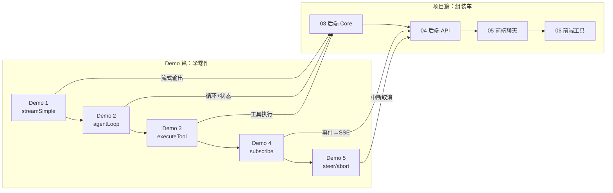
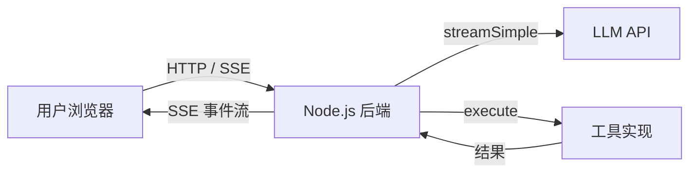

# 01 项目概述

> 把前面学到的原理和 Demo 组合起来，实现一个**可运行的全栈 Agent 应用**。这不是生产系统，但保留了 Pi 的核心设计思想，并且可以直接运行。

## Demo 和项目的关系

如果你已经跑过 [Demo 篇](/demos/) 的 5 个示例，你会发现每个 Demo 只聚焦一个机制。而项目篇的任务是**把这些"零件"组装成一辆"整车"**。



| Demo 学到的 | 在项目篇变成 |
|------------|------------|
| `streamSimple` 逐字输出 | `openai-client.ts` 完整的 SSE 解析器 |
| `agentLoop` 手动循环 | `agent-loop.ts` 带取消、限次、并发的生产级循环 |
| `execute` 工具函数 | `tools/*.ts` 带 Schema 校验的安全工具 |
| `subscribe` 终端输出 | `useAgent.ts` React Hook + SSE 消费 |
| `steer/abort` 中断 | `Agent` 类内置 `AbortController` |

## 我们要做什么？

一个基于 Web 的 AI Agent 应用：



**功能清单**：

- [x] 流式对话（逐字显示 AI 回复）
- [x] 工具调用（天气查询、计算器、搜索）
- [x] 工具执行可视化（显示执行中/成功/失败状态）
- [x] 多轮对话历史
- [x] 会话管理（新建、重置、导出）
- [x] Mock LLM 模式（无需 API key 即可演示）
- [x] 上下文压缩（简化版）
- [x] **请求体验证**（TypeBox Schema）
- [x] **AbortController 取消**（用户断开取消 LLM/工具）
- [x] **Session TTL / 容量限制**（防内存泄漏）

**不做的功能**（保持教学聚焦）：

- [ ] 多提供商支持（只保留 OpenAI 兼容协议）
- [ ] 终端 UI（用 Web 替代）
- [ ] 文件系统工具（避免安全风险）
- [ ] 扩展系统
- [ ] 用户认证

## 技术栈

| 层级 | 技术 | 理由 |
|------|------|------|
| 前端 | React 18 + TypeScript | 组件化、类型安全、生态成熟 |
| 前端构建 | Vite | 快、配置简单 |
| 前端样式 | Tailwind CSS | 原子化、不离开 HTML 写样式 |
| 后端 | Node.js + Fastify | 比 Express 更快、类型友好 |
| 后端流式 | SSE (Server-Sent Events) | 比 WebSocket 简单，适合单向推送 |
| 类型共享 | 前后端共用 `shared/types.ts` | 避免重复定义、保证一致 |
| 参数校验 | TypeBox | JSON Schema + TypeScript 类型一体 |
| 测试 | Vitest | 快、ESM 原生支持 |

## 项目结构

```
playground/
├── backend/
│   ├── src/
│   │   ├── core/
│   │   │   ├── types.ts           # Agent 核心类型
│   │   │   ├── agent-loop.ts      # Agent Loop 实现
│   │   │   ├── agent.ts           # Agent 类（含 AbortController）
│   │   │   ├── tool-registry.ts   # 工具注册表
│   │   │   └── agent-loop.test.ts # 单元测试
│   │   ├── llm/
│   │   │   ├── openai-client.ts   # OpenAI 兼容客户端（修复 tool_calls）
│   │   │   └── mock-client.ts     # Mock 客户端（无需 API key）
│   │   ├── tools/
│   │   │   ├── weather.ts         # 天气工具
│   │   │   ├── calculator.ts      # 计算器（安全实现，无 eval）
│   │   │   ├── search.ts          # 搜索工具
│   │   │   └── index.ts           # 工具导出
│   │   ├── session/
│   │   │   └── session-manager.ts # 会话管理（TTL + LRU）
│   │   ├── api/
│   │   │   ├── server.ts          # Fastify 服务器
│   │   │   ├── routes.ts          # HTTP 路由（含 Schema 校验）
│   │   │   └── sse.ts             # SSE 流处理
│   │   └── index.ts               # 入口
│   ├── package.json
│   ├── tsconfig.json
│   └── vitest.config.ts
│
├── frontend/
│   ├── src/
│   │   ├── components/
│   │   │   ├── Chat.tsx             # 聊天主界面
│   │   │   ├── MessageBubble.tsx    # 消息气泡
│   │   │   ├── ToolCard.tsx         # 工具执行卡片
│   │   │   └── TypingIndicator.tsx  # 输入动画
│   │   ├── hooks/
│   │   │   └── useAgent.ts          # Agent 连接 hook（messageId 映射）
│   │   ├── App.tsx
│   │   ├── main.tsx
│   │   └── index.css
│   ├── index.html
│   ├── package.json
│   ├── vite.config.ts
│   ├── tailwind.config.js
│   └── tsconfig.json
│
└── shared/
    └── types.ts                     # 前后端共享类型
```

## 与 Pi 原版的对应关系

| 教学版文件 | Pi 原版文件 | 简化点 |
|-----------|-----------|--------|
| `backend/src/llm/openai-client.ts` | `pi-ai/src/stream.ts` | 只支持 OpenAI 协议 |
| `backend/src/core/agent-loop.ts` | `pi-agent-core/src/agent-loop.ts` | 去掉 transport、getApiKey |
| `backend/src/core/agent.ts` | `pi-agent-core/src/agent.ts` | 简化错误重试，加 AbortController |
| `backend/src/session/session-manager.ts` | `pi-coding-agent/src/core/session-manager.ts` | 内存存储，加 TTL/LRU |

## 运行效果预览

```
┌─────────────────────────────────────────┐
│  Pi Agent 教学版        [Mock ☑] [新会话]│
├─────────────────────────────────────────┤
│                                         │
│  You: 北京天气怎么样？                  │
│                                         │
│  🤖 我来查一下北京的天气...              │
│  ⏳ weather 执行中... 已执行 1 秒       │
│  ✅ weather 已完成                      │
│     北京当前天气：小雨，18°C            │
│  🤖 北京今天小雨，气温 18°C             │
│                                         │
│  [________________] [发送]              │
└─────────────────────────────────────────┘
```

## 开发计划

1. [02 技术选型与目录结构](02-tech-stack) — 初始化项目
2. [03 后端：Agent Core](03-backend-core) — 实现 Agent Loop 和工具系统
3. [04 后端：HTTP API 与 SSE](04-backend-api) — 暴露 REST 和流式接口
4. [05 前端：React 聊天界面](05-frontend-chat) — 实现消息显示和输入
5. [06 前端：工具执行可视化](06-frontend-tools) — 显示工具状态
6. [07 联调与运行](07-integration) — 跑通全流程
7. [08 扩展方向](08-extensions) — 你可以继续做什么

## 本章小结

- 教学版项目是一个**全栈 Web 应用**，保留 Pi 核心思想，简化外围功能。
- **Demo 是零件，项目是整车**。理解每个 Demo 的机制后，再看项目代码会知其所以然。
- 技术栈选择以**易读、易运行、易扩展**为优先。
- 每一章都会提供可直接运行的代码，确保你能跟着一步步做出来。

## 准备工作

在开始之前，请确保你的环境满足：
- Node.js >= 18
- npm >= 9
- 一个 OpenAI API key（或使用 Mock 模式）

```bash
node -v  # >= 18
npm -v   # >= 9
```
