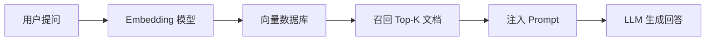
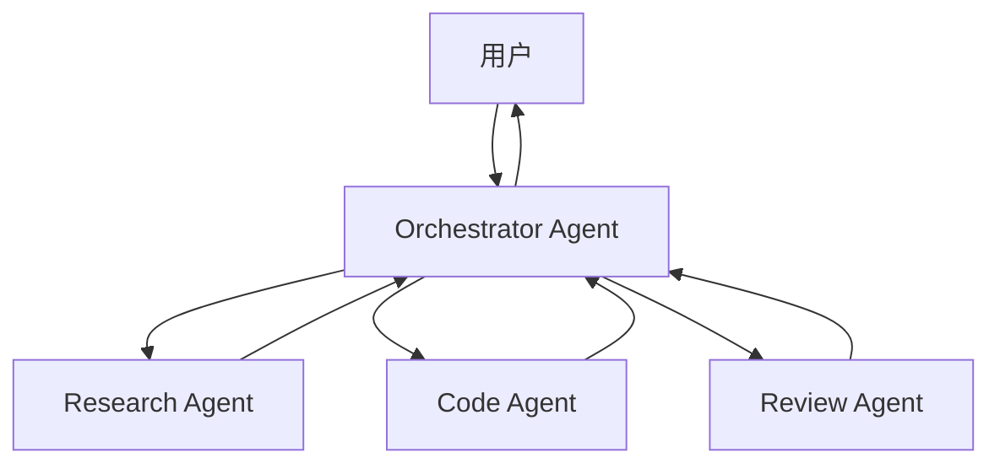

# 08 扩展方向

> 教学版项目已经跑起来了，但这只是开始。这一章列出你可以继续深入的方向，每个方向都给出了具体的学习路径和实现思路。

## 方向 1：接入更多 LLM 提供商

当前只支持 OpenAI 兼容协议。可以扩展支持：

- **Anthropic Claude**：原生 Messages API，支持 thinking 块
- **Google Gemini**：Generative AI 协议，多模态能力强
- **本地模型**：Ollama、LM Studio，通过本地 HTTP 接口调用
- **Azure OpenAI**：企业级部署，需要适配身份验证

**实现思路**：

```ts
// llm/provider.ts
interface LLMProvider {
  name: string
  stream(messages: Message[], tools: ToolDefinition[]): AsyncIterable<AgentEvent>
}

class AnthropicProvider implements LLMProvider {
  async *stream(messages, tools) {
    // 调用 Anthropic SDK，yield 统一格式的事件
  }
}

class OllamaProvider implements LLMProvider {
  async *stream(messages, tools) {
    // 调用本地 http://localhost:11434
  }
}
```

## 方向 2：RAG（检索增强生成）

让 Agent 能读取你的文档并基于文档回答：



**技术栈**：
- Embedding：OpenAI `text-embedding-3-small` 或本地 `nomic-embed-text`
- 向量数据库：Pinecone、Weaviate、或内存中的 `hnswlib`
- 分块策略：按段落、按固定 token 数、或递归分块

**实现思路**：

```ts
// 在 transformContext 中注入检索结果
const agent = new Agent({
  transformContext: async (messages) => {
    const lastUserMsg = messages.findLast(m => m.role === 'user')
    if (!lastUserMsg) return messages

    const query = typeof lastUserMsg.content === 'string' ? lastUserMsg.content : ''
    const docs = await vectorStore.search(query, 3)

    const contextMsg: Message = {
      role: 'user',
      content: `[Context]\n${docs.map(d => d.content).join('\n---\n')}`,
      timestamp: Date.now(),
    }

    return [...messages, contextMsg]
  }
})
```

## 方向 3：多 Agent 协作

一个 Agent 的能力有限，可以让多个 Agent 分工协作：



**实现思路**：

```ts
class MultiAgentSystem {
  private orchestrator = new Agent({...})
  private specialists = {
    research: new Agent({...}),
    code: new Agent({...}),
    review: new Agent({...}),
  }

  async process(task: string) {
    // 1. Orchestrator 分析任务，决定分配给哪个专家
    const plan = await this.orchestrator.prompt(`Analyze: ${task}`)

    // 2. 并行调用专家
    const results = await Promise.all(
      plan.steps.map(step => this.specialists[step.agent].prompt(step.instruction))
    )

    // 3. Orchestrator 整合结果
    return this.orchestrator.prompt(`Synthesize: ${JSON.stringify(results)}`)
  }
}
```

## 方向 4：持久化与多用户

当前是内存存储，生产环境需要：

| 功能 | 技术方案 |
|------|---------|
| 会话持久化 | PostgreSQL + JSONB 字段，或 MongoDB |
| 用户认证 | JWT + bcrypt，或 OAuth (GitHub/Google) |
| 实时同步 | WebSocket 替代 SSE，支持多设备 |
| 消息队列 | Redis Pub/Sub 或 RabbitMQ，处理高并发 |

**会话表设计**：

```sql
CREATE TABLE sessions (
  id UUID PRIMARY KEY,
  user_id UUID REFERENCES users(id),
  title TEXT,
  messages JSONB NOT NULL DEFAULT '[]',
  created_at TIMESTAMPTZ DEFAULT NOW(),
  updated_at TIMESTAMPTZ DEFAULT NOW()
);

CREATE INDEX idx_sessions_user ON sessions(user_id, updated_at DESC);
```

## 方向 5：代码执行沙箱

Pi 的 `bash` 工具直接在宿主机执行，有安全风险。可以替换为：

- **Docker 沙箱**：每个工具调用启动一个临时容器
- **WebAssembly**：用 Wasm 运行隔离的代码（如 QuickJS）
- **E2B**：云端代码执行沙箱，专为 AI Agent 设计

```ts
const sandboxTool: AgentTool = {
  name: 'python',
  execute: async (id, params) => {
    const sandbox = await e2bSandbox.create()
    const result = await sandbox.runPython(params.code)
    return { content: [{ type: 'text', text: result.stdout }] }
  }
}
```

## 方向 6：自定义 UI 组件

当前 UI 比较基础，可以扩展：

- **Markdown 渲染**：用 `react-markdown` 支持代码高亮、表格、列表
- **Mermaid 图表**：AI 生成 Mermaid 语法，前端实时渲染
- **文件上传**：支持图片、PDF、代码文件的多模态输入
- **思维导图**：把对话结构可视化为树形图
- **Diff 视图**：代码修改时显示 before/after 对比

## 方向 7：自动化测试

为 Agent 系统写测试有其特殊性：

```ts
// 测试 Agent 事件序列
import { describe, it, expect } from 'vitest'

describe('Agent Loop', () => {
  it('should execute tool and continue', async () => {
    const events: AgentEvent[] = []
    const agent = new Agent({...})

    agent.subscribe(e => events.push(e))
    await agent.prompt('Calculate 2+2', { useMock: true })

    expect(events.map(e => e.type)).toEqual([
      'agent_start',
      'turn_start',
      'message_start',
      'message_end',
      'message_start',
      'message_update',
      'message_end',
      'tool_execution_start',
      'tool_execution_end',
      'turn_end',
      'turn_start',
      'message_start',
      'message_update',
      'message_end',
      'turn_end',
      'agent_end',
    ])
  })
})
```

**测试策略**：
- Mock LLM：验证事件序列和状态转换
- 快照测试：验证 UI 渲染结果
- 集成测试：用真实 API（控制成本）
- 混沌测试：随机断开连接、超时、错误响应

## 方向 8：贡献给 Pi 社区

Pi 是开源项目，你可以：

1. **提交 Issue**：报告 bug 或提出功能建议
2. **提交 PR**：修复问题或实现新功能
3. **写扩展**：发布自己的 Pi Package
4. **写文档**：完善官方文档或翻译

Pi 的扩展系统允许你注册：
- 自定义工具
- 自定义命令（`/` 开头的斜杠命令）
- 自定义事件处理器
- 自定义 UI 组件（TUI 模式）

## 学习资源推荐

| 主题 | 资源 |
|------|------|
| Pi 官方文档 | https://pi.dev/docs/latest |
| Pi GitHub | https://github.com/earendil-works/pi |
| TypeBox | https://github.com/sinclairzx81/typebox |
| Fastify | https://www.fastify.io/docs/latest/ |
| SSE 规范 | https://html.spec.whatwg.org/multipage/server-sent-events.html |
| Function Calling | OpenAI / Anthropic / Google 的官方文档 |

## 写在最后

Agent 不是魔法，而是一套精心设计的工程系统：

```
状态管理 + 事件循环 + 工具执行 + 上下文压缩 + 人机协作
```

Pi 用最少的代码展示了这些机制可以如何优雅地实现。希望这个教程让你不仅“会用 Agent”，更能“理解 Agent 为什么这样设计”。

如果你从零跟着做到了这里，你已经具备了：
- 阅读和理解生产级 Agent 源码的能力
- 独立实现 Agent 核心机制的能力
- 把 Agent 集成到全栈应用中的能力

下一步，去造点有趣的东西吧 🚀
